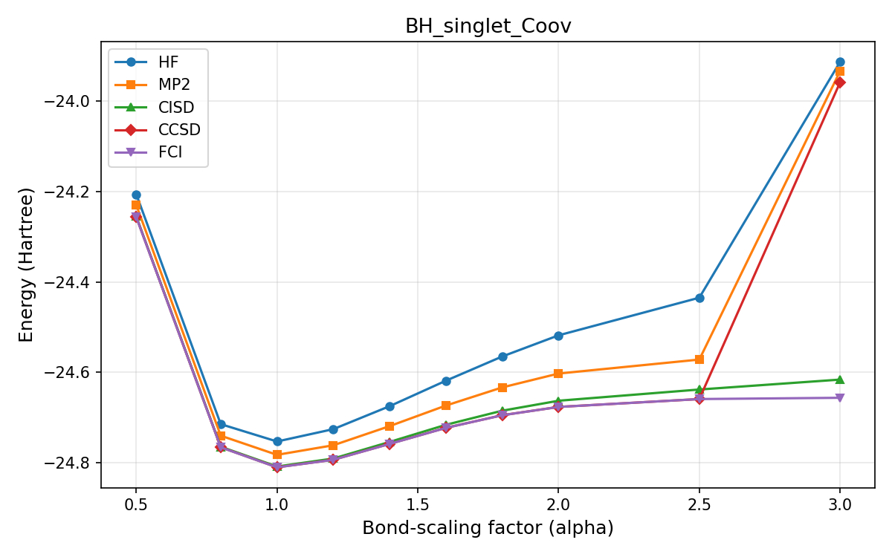
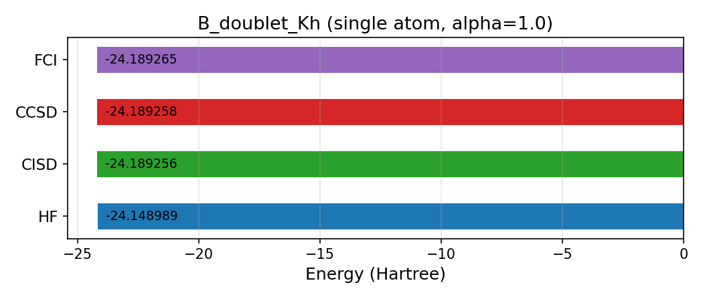
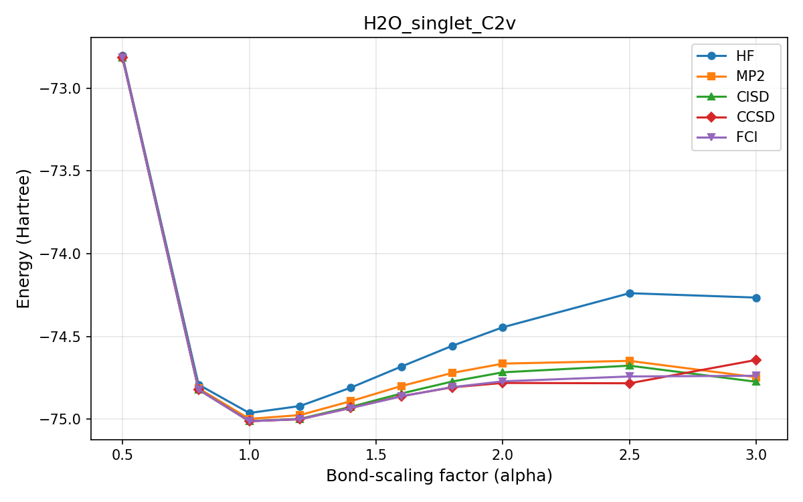
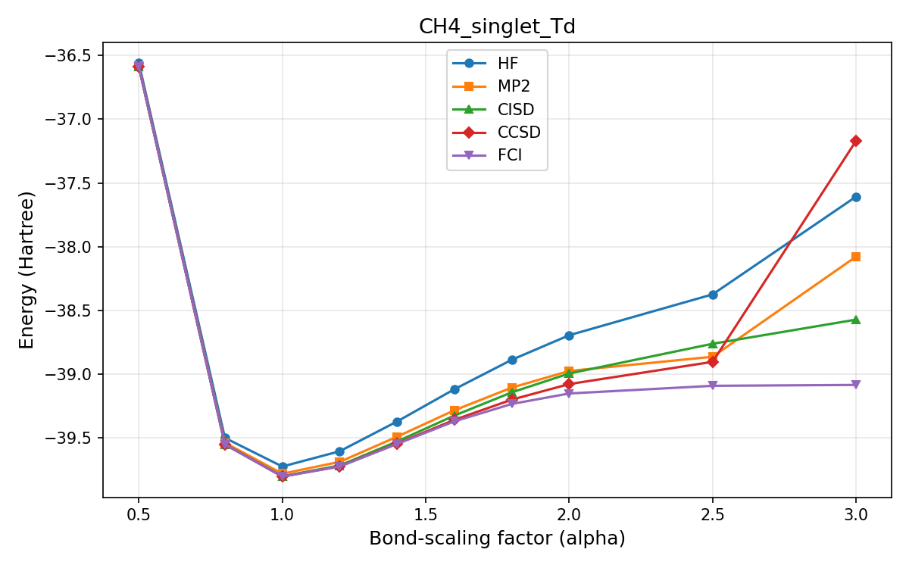
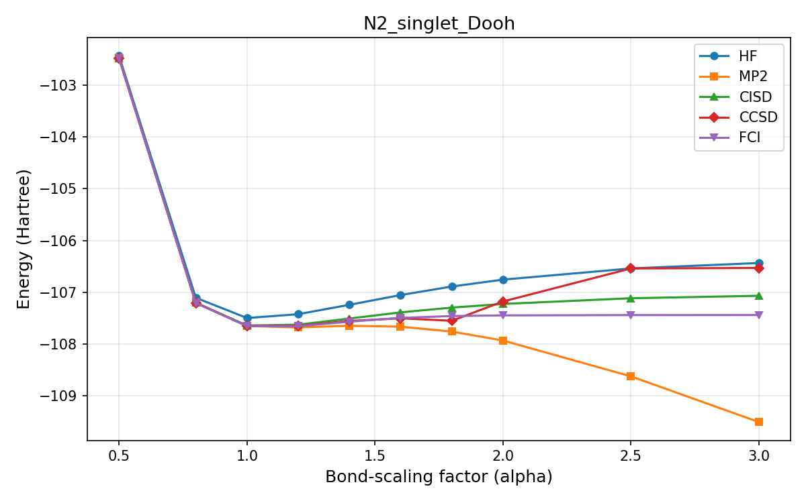
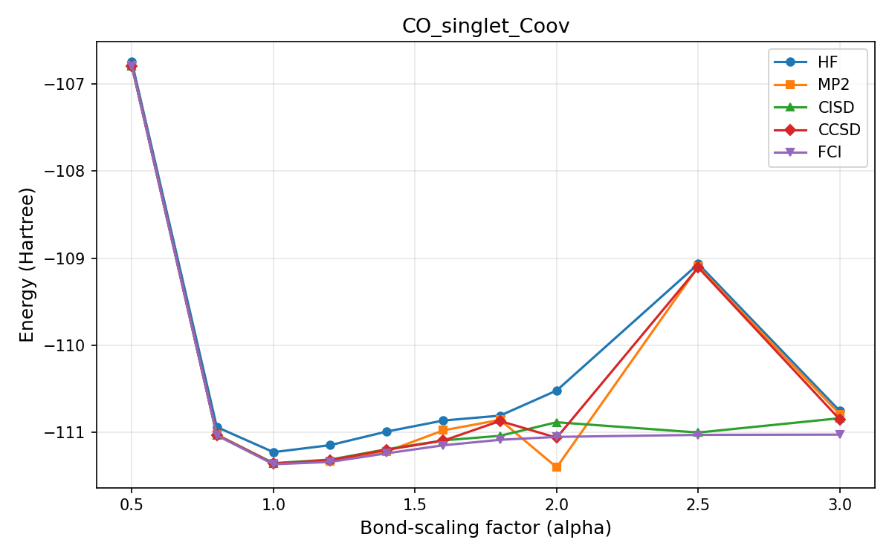
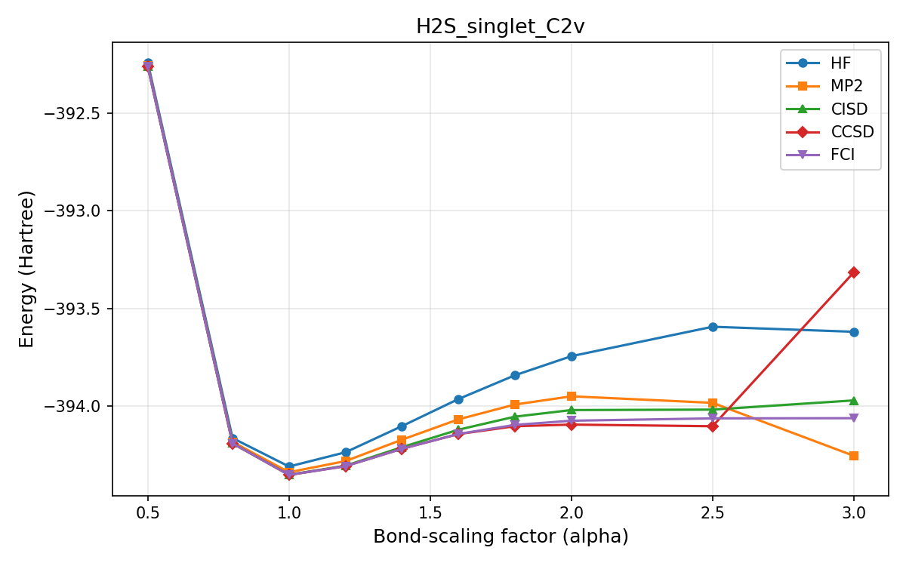

# Bond-Scaling Pipeline Test Report

**Date**: 2026-02-16 21:18

**Grid**: 10 points, alpha = [0.5, ..., 3.0]

**Basis**: sto-3g

## Summary

| # | ID | Formula | Atoms | Charge | Mult | e- | Qubits | Computed | Skipped | Failed | Time (s) |
|---|---|---|---|---|---|---|---|---|---|---|---|
| 1 | `B+_singlet_Kh` | B | 1 | 1 | 1 | 4 | 8 | 0 | 1 | 0 | 0.0 |
| 2 | `BH2+_singlet_C2v` | BH2 | 3 | 1 | 1 | 6 | 10 | 0 | 10 | 0 | 0.0 |
| 3 | `BH_singlet_Coov` | BH | 2 | 0 | 1 | 6 | 8 | 0 | 10 | 0 | 0.0 |
| 4 | `B_doublet_Kh` | B | 1 | 0 | 2 | 5 | 8 | 0 | 1 | 0 | 0.0 |
| 5 | `BeH+_singlet_Coov` | BeH | 2 | 1 | 1 | 4 | 8 | 0 | 10 | 0 | 0.0 |
| 6 | `H2O_singlet_C2v` | H2O | 3 | 0 | 1 | 10 | 10 | 10 | 0 | 0 | 2.7 |
| 7 | `CH4_singlet_Td` | CH4 | 5 | 0 | 1 | 10 | 14 | 10 | 0 | 0 | 8.9 |
| 8 | `N2_singlet_Dooh` | N2 | 2 | 0 | 1 | 14 | 15 | 10 | 0 | 0 | 8.6 |
| 9 | `CO_singlet_Coov` | CO | 2 | 0 | 1 | 14 | 16 | 10 | 0 | 0 | 14.3 |
| 10 | `H2S_singlet_C2v` | H2S | 3 | 0 | 1 | 18 | 18 | 10 | 0 | 0 | 17.6 |

---

## B+_singlet_Kh

- **Formula**: B
- **Atoms**: 1
- **Charge**: 1
- **Multiplicity**: 1
- **Electrons**: 4
- **Qubits (STO-3G)**: 8
- **Single atom**: Yes

### Energies (Hartree)

| Alpha | HF | MP2 | CISD | CCSD | FCI | Errors |
|---|---|---|---|---|---|---|
| 1.000 | -23.948470 | -23.978501 | -24.009805 | -24.009811 | -24.009815 | — |

---

## BH2+_singlet_C2v

- **Formula**: BH2
- **Atoms**: 3
- **Charge**: 1
- **Multiplicity**: 1
- **Electrons**: 6
- **Qubits (STO-3G)**: 10
- **Single atom**: No

### Energies (Hartree)

| Alpha | HF | MP2 | CISD | CCSD | FCI | Errors |
|---|---|---|---|---|---|---|
| 0.500 | -23.819828 | -23.838402 | -23.844494 | -23.844619 | -23.844809 | — |
| 0.800 | -25.031181 | -25.053152 | -25.061732 | -25.061952 | -25.062219 | — |
| 1.000 | -25.141787 | -25.170543 | -25.183640 | -25.184151 | -25.184652 | — |
| 1.200 | -25.095969 | -25.134883 | -25.155292 | -25.156589 | -25.157683 | — |
| 1.400 | -24.997168 | -25.049888 | -25.080915 | -25.084132 | -25.086557 | — |
| 1.600 | -24.888733 | -24.959237 | -25.005136 | -25.012823 | -25.017199 | — |
| 1.800 | -24.790977 | -24.885073 | -24.951054 | -24.967722 | -24.972325 | — |
| 2.000 | -24.713336 | -24.843313 | -24.923649 | -24.949851 | -24.953557 | — |
| 2.500 | -24.604871 | -24.900029 | -24.903603 | -24.942075 | -24.944363 | — |
| 3.000 | -24.562292 | -25.042802 | -24.900542 | -24.250945 | -24.943184 | — |

---

## BH_singlet_Coov

- **Formula**: BH
- **Atoms**: 2
- **Charge**: 0
- **Multiplicity**: 1
- **Electrons**: 6
- **Qubits (STO-3G)**: 8
- **Single atom**: No

### Energies (Hartree)

| Alpha | HF | MP2 | CISD | CCSD | FCI | Errors |
|---|---|---|---|---|---|---|
| 0.500 | -24.206179 | -24.230004 | -24.255237 | -24.256098 | -24.256647 | — |
| 0.800 | -24.714431 | -24.739943 | -24.764349 | -24.765465 | -24.765677 | — |
| 1.000 | -24.752780 | -24.782280 | -24.808145 | -24.809787 | -24.809945 | — |
| 1.200 | -24.725468 | -24.761109 | -24.790459 | -24.793079 | -24.793237 | — |
| 1.400 | -24.674705 | -24.718784 | -24.753745 | -24.757991 | -24.758153 | — |
| 1.600 | -24.618339 | -24.673281 | -24.715857 | -24.722553 | -24.722701 | — |
| 1.800 | -24.564825 | -24.633180 | -24.684685 | -24.694657 | -24.694769 | — |
| 2.000 | -24.518067 | -24.602535 | -24.662658 | -24.676336 | -24.676397 | — |
| 2.500 | -24.434858 | -24.571613 | -24.637860 | -24.658957 | -24.658934 | — |
| 3.000 | -23.913465 | -23.933988 | -24.615903 | -23.958717 | -24.656174 | — |

---

## B_doublet_Kh

- **Formula**: B
- **Atoms**: 1
- **Charge**: 0
- **Multiplicity**: 2
- **Electrons**: 5
- **Qubits (STO-3G)**: 8
- **Single atom**: Yes

### Energies (Hartree)

| Alpha | HF | MP2 | CISD | CCSD | FCI | Errors |
|---|---|---|---|---|---|---|
| 1.000 | -24.148989 | — | -24.189256 | -24.189258 | -24.189265 | ccsd_operator |

---

## BeH+_singlet_Coov

- **Formula**: BeH
- **Atoms**: 2
- **Charge**: 1
- **Multiplicity**: 1
- **Electrons**: 4
- **Qubits (STO-3G)**: 8
- **Single atom**: No

### Energies (Hartree)

| Alpha | HF | MP2 | CISD | CCSD | FCI | Errors |
|---|---|---|---|---|---|---|
| 0.500 | -14.221820 | -14.232332 | -14.236440 | -14.236442 | -14.236446 | — |
| 0.800 | -14.631667 | -14.642758 | -14.647523 | -14.647525 | -14.647533 | — |
| 1.000 | -14.664616 | -14.678655 | -14.685787 | -14.685791 | -14.685805 | — |
| 1.200 | -14.641868 | -14.660763 | -14.672224 | -14.672230 | -14.672254 | — |
| 1.400 | -14.600567 | -14.626324 | -14.644294 | -14.644303 | -14.644344 | — |
| 1.600 | -14.556712 | -14.591134 | -14.617141 | -14.617159 | -14.617220 | — |
| 1.800 | -14.517370 | -14.561715 | -14.596026 | -14.596057 | -14.596138 | — |
| 2.000 | -14.485092 | -14.540004 | -14.581763 | -14.581813 | -14.581911 | — |
| 2.500 | -14.433959 | -14.515875 | -14.567289 | -14.567382 | -14.567507 | — |
| 3.000 | -14.411453 | -14.519630 | -14.564842 | -14.564958 | -14.565094 | — |

---

## H2O_singlet_C2v

- **Formula**: H2O
- **Atoms**: 3
- **Charge**: 0
- **Multiplicity**: 1
- **Electrons**: 10
- **Qubits (STO-3G)**: 10
- **Single atom**: No

### Energies (Hartree)

| Alpha | HF | MP2 | CISD | CCSD | FCI | Errors |
|---|---|---|---|---|---|---|
| 0.500 | -72.804620 | -72.814821 | -72.817005 | -72.817021 | -72.817038 | — |
| 0.800 | -74.791723 | -74.814354 | -74.821448 | -74.821598 | -74.821653 | — |
| 1.000 | -74.963023 | -74.998569 | -75.011873 | -75.012462 | -75.012578 | — |
| 1.200 | -74.920967 | -74.975657 | -74.998377 | -75.000478 | -75.000760 | — |
| 1.400 | -74.810032 | -74.891695 | -74.926014 | -74.932381 | -74.933044 | — |
| 1.600 | -74.682408 | -74.799994 | -74.845197 | -74.861309 | -74.862255 | — |
| 1.800 | -74.557619 | -74.721207 | -74.773007 | -74.807928 | -74.806879 | — |
| 2.000 | -74.445163 | -74.664654 | -74.717199 | -74.781487 | -74.771770 | — |
| 2.500 | -74.239226 | -74.648048 | -74.677016 | -74.783455 | -74.742324 | — |
| 3.000 | -74.265697 | -74.746791 | -74.774422 | -74.642439 | -74.738037 | — |

---

## CH4_singlet_Td

- **Formula**: CH4
- **Atoms**: 5
- **Charge**: 0
- **Multiplicity**: 1
- **Electrons**: 10
- **Qubits (STO-3G)**: 14
- **Single atom**: No

### Energies (Hartree)

| Alpha | HF | MP2 | CISD | CCSD | FCI | Errors |
|---|---|---|---|---|---|---|
| 0.500 | -36.559176 | -36.582350 | -36.587555 | -36.587672 | -36.587730 | — |
| 0.800 | -39.502139 | -39.539788 | -39.552432 | -39.553190 | -39.553273 | — |
| 1.000 | -39.726809 | -39.783066 | -39.803044 | -39.805455 | -39.805685 | — |
| 1.200 | -39.606983 | -39.690145 | -39.718913 | -39.725651 | -39.726536 | — |
| 1.400 | -39.373089 | -39.492732 | -39.529868 | -39.546310 | -39.549703 | — |
| 1.600 | -39.119739 | -39.284935 | -39.326314 | -39.360125 | -39.371916 | — |
| 1.800 | -38.888583 | -39.107054 | -39.144250 | -39.201559 | -39.235466 | — |
| 2.000 | -38.695890 | -38.976563 | -38.996433 | -39.079379 | -39.153168 | — |
| 2.500 | -38.374930 | -38.864850 | -38.762791 | -38.904869 | -39.093016 | — |
| 3.000 | -37.607579 | -38.078520 | -38.573318 | -37.169624 | -39.086066 | — |

---

## N2_singlet_Dooh

- **Formula**: N2
- **Atoms**: 2
- **Charge**: 0
- **Multiplicity**: 1
- **Electrons**: 14
- **Qubits (STO-3G)**: 15
- **Single atom**: No

### Energies (Hartree)

| Alpha | HF | MP2 | CISD | CCSD | FCI | Errors |
|---|---|---|---|---|---|---|
| 0.500 | -102.434099 | -102.471280 | -102.477196 | -102.477509 | -102.477866 | — |
| 0.800 | -107.105068 | -107.197117 | -107.201790 | -107.204656 | -107.206212 | — |
| 1.000 | -107.495866 | -107.649920 | -107.640450 | -107.648886 | -107.652772 | — |
| 1.200 | -107.421966 | -107.676676 | -107.624114 | -107.644967 | -107.654013 | — |
| 1.400 | -107.240352 | -107.645642 | -107.505770 | -107.552665 | -107.566637 | — |
| 1.600 | -107.052517 | -107.663253 | -107.387146 | -107.500666 | -107.493509 | — |
| 1.800 | -106.887854 | -107.757432 | -107.294421 | -107.549348 | -107.457339 | — |
| 2.000 | -106.754403 | -107.929669 | -107.224073 | -107.176889 | -107.444996 | — |
| 2.500 | -106.538810 | -108.622076 | -107.114008 | -106.538810 | -107.439147 | ccsd_operator |
| 3.000 | -106.433451 | -109.504244 | -107.066171 | -106.528780 | -107.438176 | — |

---

## CO_singlet_Coov

- **Formula**: CO
- **Atoms**: 2
- **Charge**: 0
- **Multiplicity**: 1
- **Electrons**: 14
- **Qubits (STO-3G)**: 16
- **Single atom**: No

### Energies (Hartree)

| Alpha | HF | MP2 | CISD | CCSD | FCI | Errors |
|---|---|---|---|---|---|---|
| 0.500 | -106.749789 | -106.788259 | -106.794608 | -106.794973 | -106.795506 | — |
| 0.800 | -110.937113 | -111.021269 | -111.027326 | -111.029472 | -111.032284 | — |
| 1.000 | -111.224579 | -111.353147 | -111.351006 | -111.355439 | -111.363384 | — |
| 1.200 | -111.144340 | -111.331113 | -111.310149 | -111.316708 | -111.336485 | — |
| 1.400 | -110.988220 | -111.216527 | -111.191140 | -111.197204 | -111.237921 | — |
| 1.600 | -110.861933 | -110.974511 | -111.089767 | -111.092363 | -111.145874 | — |
| 1.800 | -110.806069 | -110.854273 | -111.037101 | -110.867267 | -111.082895 | — |
| 2.000 | -110.517801 | -111.398813 | -110.881643 | -111.059154 | -111.049584 | — |
| 2.500 | -109.065882 | -109.098156 | -110.999761 | -109.107482 | -111.026394 | — |
| 3.000 | -110.752996 | -110.790229 | -110.835323 | -110.850844 | -111.023543 | — |

---

## H2S_singlet_C2v

- **Formula**: H2S
- **Atoms**: 3
- **Charge**: 0
- **Multiplicity**: 1
- **Electrons**: 18
- **Qubits (STO-3G)**: 18
- **Single atom**: No

### Energies (Hartree)

| Alpha | HF | MP2 | CISD | CCSD | FCI | Errors |
|---|---|---|---|---|---|---|
| 0.500 | -392.240618 | -392.255821 | -392.260260 | -392.260323 | -392.260339 | — |
| 0.800 | -394.165648 | -394.185375 | -394.192552 | -394.192723 | -394.192758 | — |
| 1.000 | -394.311556 | -394.340691 | -394.353810 | -394.354432 | -394.354498 | — |
| 1.200 | -394.238459 | -394.283599 | -394.307261 | -394.309645 | -394.309794 | — |
| 1.400 | -394.104282 | -394.173879 | -394.212212 | -394.220272 | -394.220537 | — |
| 1.600 | -393.965298 | -394.069535 | -394.122615 | -394.144887 | -394.144362 | — |
| 1.800 | -393.843372 | -393.993472 | -394.055757 | -394.104776 | -394.097980 | — |
| 2.000 | -393.745408 | -393.951326 | -394.021855 | -394.096366 | -394.076514 | — |
| 2.500 | -393.594436 | -393.984737 | -394.019593 | -394.104795 | -394.064481 | — |
| 3.000 | -393.620227 | -394.256271 | -393.972294 | -393.315667 | -394.063548 | — |

