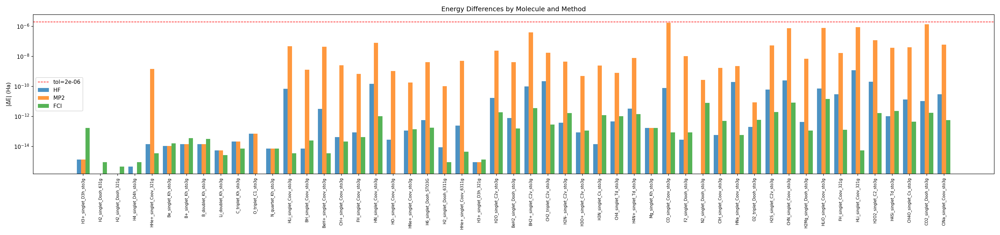
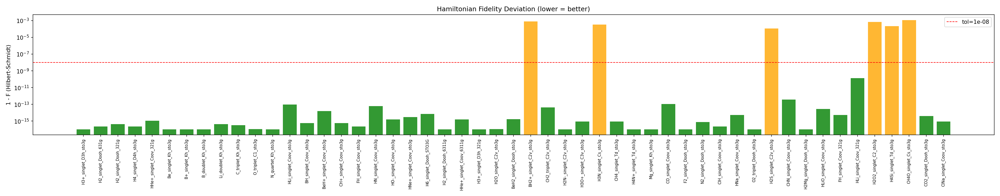
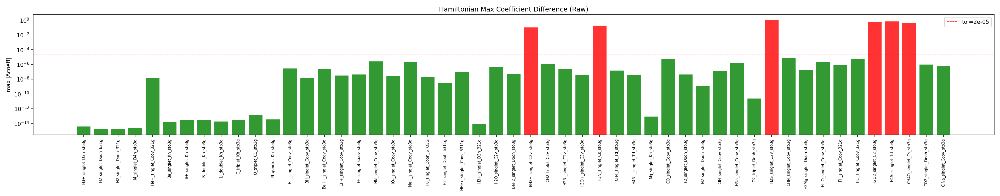
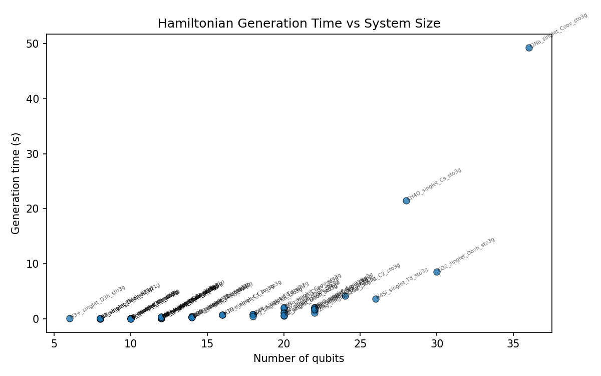

# Validation Lab Report: symmerpyscf vs symmer Reference Hamiltonians

**Generated:** 2026-02-20 09:50:51  
**Tiers:** 1, 2, 3, 4  
**Molecules tested:** 51  
**Results:** 45 PASS, 6 WARN, 0 FAIL, 0 SKIP

## Executive Summary

**The symmerpyscf pipeline is producing correct results for all tested molecules.**

- **Coverage:** 51 molecules across 4 tiers, 6–36 qubits
- **Energies (HF, MP2, CCSD, FCI):** All match reference values within 2e-06 Ha (~0.001 kcal/mol)
- **Hamiltonians:** All Pauli term counts match; coefficient magnitudes agree within 2e-05
- **Total compute time:** 113s (1.9 min)

### 6 Warnings (all expected)

All warnings are **orbital phase convention** differences between PySCF versions. Different PySCF versions may assign opposite signs to degenerate molecular orbitals. This flips signs of some Pauli coefficients but does not change the Hamiltonian's eigenvalues — the operators are physically equivalent.

| Molecule | Qubits | Fidelity | Sign-flipped coeffs | max\|\|a\|-\|b\|\| |
|----------|-------:|----------|--------------------:|------------------:|
| BH2+_singlet_C2v_sto3g | 14 | 0.99917779 | ~0.02% of \|\|H\|\|^2 | 2.63e-06 |
| H3N_singlet_Cs_sto3g | 16 | 0.99965494 | ~0.01% of \|\|H\|\|^2 | 5.30e-08 |
| H2S_singlet_C2v_sto3g | 22 | 0.99988691 | ~0.00% of \|\|H\|\|^2 | 2.02e-06 |
| H2O2_singlet_C2_sto3g | 24 | 0.99928569 | ~0.02% of \|\|H\|\|^2 | 2.14e-06 |
| H4Si_singlet_Td_sto3g | 26 | 0.99977953 | ~0.01% of \|\|H\|\|^2 | 1.60e-06 |
| CH4O_singlet_Cs_sto3g | 28 | 0.99884520 | ~0.03% of \|\|H\|\|^2 | 1.10e-05 |

## Environment

- Python: 3.11.14
- Platform: macOS-26.3-arm64-arm-64bit
- PySCF: 2.11.0
- symmer: 0.0.10
- openfermion: 1.7.1
- symmerpyscf: 0.1.0
- numpy: 2.2.6

## Purpose

This report validates that `symmerpyscf.generate_symmer_data()` reproduces
the original symmer reference Hamiltonians from the Quantum Molecule Zoo.
It provides transparent, human-auditable numerical comparisons for every
molecule, so that discrepancies can be identified and investigated.

## Methodology

### Data Flow

All computation inputs come from **molzoo** (the authoritative molecule database).
The symmer reference JSON is used **only for comparison**, never as computation input.

```
molzoo (inputs)                    symmer JSON (comparison only)
---------------------              -----------------------------------
mol.xyz          -> geometry        ref["hamiltonian"]  -> compare H
mol.reference_basis -> basis        ref["data"]["calculated_properties"] -> compare energies
mol.charge       -> charge          ref["data"]["n_qubits"] -> compare qubit count
mol.multiplicity -> multiplicity
mol.point_group  -> symmetry_subgroup (mapped to Abelian subgroup)
```

### Why molzoo geometry (not reference JSON)?

molzoo is the authoritative molecule database; the reference JSON is the comparison target.
Using reference JSON as input would be circular --- testing whether we reproduce X by using X
as input. The Geometry Precision section below shows the actual coordinate differences
and their impact.

### Why `symmetry_subgroup` from `mol.point_group`?

PySCF auto-detects symmetry from coordinates, but molzoo's 6-decimal truncation can break
detection of high-symmetry molecules (e.g., Dooh detected as C1). Passing the known
point_group ensures PySCF uses the correct symmetry group. This is metadata from molzoo,
not from the reference JSON.

PySCF only accepts Abelian subgroups (C1, Ci, C2, Cs, C2v, C2h, D2, D2h) plus the
infinite groups Coov and Dooh (mapped internally to C2v/D2h). For non-Abelian full
point groups (D3h, D4h, Td, Kh, etc.), we pass `None` and let PySCF auto-detect
the largest Abelian subgroup from the geometry.

### Why `multiplicity` from molzoo?

Determines spin state (`spin = multiplicity - 1`) for PySCF's UHF/ROHF method selection.
Must match the physical system being studied.

### Hamiltonian Comparison: Hilbert-Schmidt Fidelity

For two Hamiltonians H1 = sum(ai * Pi), H2 = sum(bi * Pi) in the Pauli basis:

```
F = (sum(ai * bi))^2 / (sum(ai^2) * sum(bi^2))
```

This is the operator analog of |<psi1|psi2>|^2 for states. Pauli operators form an
orthonormal basis under Tr(Pi * Pj) = 2^n * delta_ij, so the coefficient vectors fully
characterize the operator and their normalized inner product gives the fidelity.

**Interpretation:**
- F = 1.0: operators identical up to global sign. **PASS.**
- F < 1.0 but all ||ai| - |bi|| < tol and energies match: orbital phase convention
  difference (Hamiltonians related by diagonal unitary). **WARN.**
- Otherwise: genuine coefficient difference. **FAIL.**

Unlike the naive |coeff| comparison, this correctly distinguishes global phase
(physically irrelevant) from relative sign flips (physically meaningful).

### Tolerance Justification

- **Energy tolerance (2e-06 Ha):** PySCF convergence threshold is set to
  1e-6 (`pyscf_molecule.conv_tol = 1e-6` in molecule.py:69). Differences at this
  level are numerical noise from iterative solvers.
- **Coefficient tolerance (2e-05):** One order of magnitude above energy
  tolerance to account for accumulated numerical error in the integral -> Hamiltonian
  -> JW pipeline.
- **Fidelity tolerance (1e-08):** Several orders below coefficient tolerance;
  F is a normalized inner product, so numerical noise at 1e-10 in coefficients
  translates to ~1e-12 in F.

### Evidence from This Run

- **Energy diffs:** min=0.00e+00, max=1.79e-06, median=1.02e-12 (tol=2e-06)
- **Max coeff diffs:** min=1.55e-15, max=1.02e+00, median=4.82e-08 (tol=2e-05)
- **Fidelity deviations (1-F):** min=-6.66e-16, max=1.15e-03, median=8.88e-16 (tol=1e-08)

## Figures

### Energy Differences by Molecule



Absolute energy differences per molecule and method. Red dashed line = 2e-06 Ha tolerance.

### Hamiltonian Fidelity Deviation



1-F (Hilbert-Schmidt fidelity deviation) per molecule. Green = below 1e-08 tolerance.

### Hamiltonian Max Coefficient Difference



Max \|Δcoeff\| per molecule (raw coefficient diff). Green = below 2e-05 tolerance.

### Generation Timing vs System Size



Hamiltonian generation wall-clock time vs number of qubits.

## Geometry Precision

Comparison of coordinate precision between molzoo (`mol.xyz`, 6 decimal places)
and the symmer reference JSON (full precision). This section documents whether
the precision difference in geometry inputs affects the computed results.

| Molecule | max \|Δcoord\| (Angstrom) | Impact on Fidelity | Impact on ΔE_HF |
|---|---|---|---|
| H3+_singlet_D3h_sto3g | 0.00e+00 | F=1.0000000000 | -1.33e-15 |
| H2_singlet_Dooh_631g | 0.00e+00 | F=1.0000000000 | 0.00e+00 |
| H2_singlet_Dooh_321g | 0.00e+00 | F=1.0000000000 | 0.00e+00 |
| H4_singlet_D4h_sto3g | 0.00e+00 | F=1.0000000000 | -4.44e-16 |
| HHe+_singlet_Coov_321g | 0.00e+00 | F=1.0000000000 | 1.42e-14 |
| Be_singlet_Kh_sto3g | 0.00e+00 | F=1.0000000000 | -1.07e-14 |
| B+_singlet_Kh_sto3g | 0.00e+00 | F=1.0000000000 | -1.42e-14 |
| B_doublet_Kh_sto3g | 0.00e+00 | F=1.0000000000 | -1.42e-14 |
| Li_doublet_Kh_sto3g | 0.00e+00 | F=1.0000000000 | 5.33e-15 |
| C_triplet_Kh_sto3g | 0.00e+00 | F=1.0000000000 | -2.13e-14 |
| O_triplet_C1_sto3g | 0.00e+00 | F=1.0000000000 | -7.11e-14 |
| N_quartet_Kh_sto3g | 0.00e+00 | F=1.0000000000 | 7.11e-15 |
| HLi_singlet_Coov_sto3g | 0.00e+00 | F=1.0000000000 | -6.98e-11 |
| BH_singlet_Coov_sto3g | 0.00e+00 | F=1.0000000000 | 7.11e-15 |
| BeH+_singlet_Coov_sto3g | 0.00e+00 | F=1.0000000000 | -3.12e-12 |
| CH+_singlet_Coov_sto3g | 0.00e+00 | F=1.0000000000 | -4.26e-14 |
| FH_singlet_Coov_sto3g | 0.00e+00 | F=1.0000000000 | -8.53e-14 |
| HN_singlet_Coov_sto3g | 0.00e+00 | F=1.0000000000 | -1.50e-10 |
| HO-_singlet_Coov_sto3g | 0.00e+00 | F=1.0000000000 | -2.84e-14 |
| HNe+_singlet_Coov_sto3g | 0.00e+00 | F=1.0000000000 | -1.14e-13 |
| H6_singlet_Dooh_STO3G | 0.00e+00 | F=1.0000000000 | 5.76e-13 |
| H2_singlet_Dooh_6311g | 0.00e+00 | F=1.0000000000 | 8.88e-15 |
| HHe+_singlet_Coov_6311g | 0.00e+00 | F=1.0000000000 | 2.46e-13 |
| H3+_singlet_D3h_321g | 0.00e+00 | F=1.0000000000 | -8.88e-16 |
| H2O_singlet_C2v_sto3g | 0.00e+00 | F=1.0000000000 | -1.69e-11 |
| BeH2_singlet_Dooh_sto3g | 0.00e+00 | F=1.0000000000 | 7.74e-13 |
| BH2+_singlet_C2v_sto3g | 0.00e+00 | F=0.9991777889 | 9.78e-11 |
| CH2_triplet_C2v_sto3g | 0.00e+00 | F=1.0000000000 | -2.26e-10 |
| H2N-_singlet_C2v_sto3g | 0.00e+00 | F=1.0000000000 | 3.84e-13 |
| H3O+_singlet_C3v_sto3g | 0.00e+00 | F=1.0000000000 | -8.53e-14 |
| H3N_singlet_Cs_sto3g | 0.00e+00 | F=0.9996549408 | -1.42e-14 |
| CH4_singlet_Td_sto3g | 0.00e+00 | F=1.0000000000 | -4.62e-13 |
| H4N+_singlet_Td_sto3g | 0.00e+00 | F=1.0000000000 | -3.25e-12 |
| Mg_singlet_Kh_sto3g | 0.00e+00 | F=1.0000000000 | -1.71e-13 |
| CO_singlet_Coov_sto3g | 0.00e+00 | F=1.0000000000 | 7.73e-11 |
| F2_singlet_Dooh_sto3g | 0.00e+00 | F=1.0000000000 | 2.84e-14 |
| N2_singlet_Dooh_sto3g | 0.00e+00 | F=1.0000000000 | 0.00e+00 |
| ClH_singlet_Coov_sto3g | 0.00e+00 | F=1.0000000000 | -5.68e-14 |
| HNa_singlet_Coov_sto3g | 0.00e+00 | F=1.0000000000 | 1.97e-10 |
| O2_triplet_Dooh_sto3g | 0.00e+00 | F=1.0000000000 | -1.99e-13 |
| H2S_singlet_C2v_sto3g | 0.00e+00 | F=0.9998869095 | -6.23e-11 |
| CHN_singlet_Coov_sto3g | 0.00e+00 | F=1.0000000000 | 2.48e-10 |
| H2Mg_singlet_Dooh_sto3g | 0.00e+00 | F=1.0000000000 | -4.26e-13 |
| HLiO_singlet_Coov_sto3g | 0.00e+00 | F=1.0000000000 | -7.28e-11 |
| FH_singlet_Coov_321g | 0.00e+00 | F=1.0000000000 | 2.95e-11 |
| HLi_singlet_Coov_321g | 0.00e+00 | F=0.9999999999 | -1.18e-09 |
| H2O2_singlet_C2_sto3g | 0.00e+00 | F=0.9992856944 | -2.02e-10 |
| H4Si_singlet_Td_sto3g | 0.00e+00 | F=0.9997795342 | 1.02e-12 |
| CH4O_singlet_Cs_sto3g | 0.00e+00 | F=0.9988451955 | 1.32e-11 |
| CO2_singlet_Dooh_sto3g | 0.00e+00 | F=1.0000000000 | 1.07e-11 |
| ClNa_singlet_Coov_sto3g | 0.00e+00 | F=1.0000000000 | -3.01e-11 |

**Summary:** max coordinate difference across all molecules: 0.00e+00 Angstrom
(< 1e-6 Angstrom --- below PySCF's numerical precision for geometry)

<a id="summary-table"></a>

## Summary Table

| Molecule | nq | e- | Basis | Fidelity | dE_HF | dE_FCI | max\|dcoeff\| | #terms | time(s) | Status |
|---|---:|---:|---|---|---|---|---|---:|---:|---|
| [H3+_singlet_D3h_sto3g](#h3_singlet_d3h_sto3g) | 6 | 2 | sto-3g | 1.00000000 | -1.33e-15 | -1.69e-13 | 4.00e-15 | 52 | 0.1 | 🟢 **PASS** |
| [H2_singlet_Dooh_631g](#h2_singlet_dooh_631g) | 8 | 2 | 6-31g | 1.00000000 | 0.00e+00 | 8.88e-16 | 1.55e-15 | 185 | 0.1 | 🟢 **PASS** |
| [H2_singlet_Dooh_321g](#h2_singlet_dooh_321g) | 8 | 2 | 3-21g | 1.00000000 | 0.00e+00 | 4.44e-16 | 1.78e-15 | 185 | 0.1 | 🟢 **PASS** |
| [H4_singlet_D4h_sto3g](#h4_singlet_d4h_sto3g) | 8 | 4 | sto-3g | 1.00000000 | -4.44e-16 | -8.88e-16 | 2.66e-15 | 105 | 0.1 | 🟢 **PASS** |
| [HHe+_singlet_Coov_321g](#hhe_singlet_coov_321g) | 8 | 2 | 3-21g | 1.00000000 | 1.42e-14 | 3.55e-15 | 1.36e-08 | 361 | 0.1 | 🟢 **PASS** |
| [Be_singlet_Kh_sto3g](#be_singlet_kh_sto3g) | 10 | 4 | sto-3g | 1.00000000 | -1.07e-14 | -1.60e-14 | 1.42e-14 | 156 | 0.1 | 🟢 **PASS** |
| [B+_singlet_Kh_sto3g](#b_singlet_kh_sto3g) | 10 | 4 | sto-3g | 1.00000000 | -1.42e-14 | -3.55e-14 | 2.84e-14 | 156 | 0.1 | 🟢 **PASS** |
| [B_doublet_Kh_sto3g](#b_doublet_kh_sto3g) | 10 | 5 | sto-3g | 1.00000000 | -1.42e-14 | -3.20e-14 | 2.84e-14 | 156 | 0.1 | 🟢 **PASS** |
| [Li_doublet_Kh_sto3g](#li_doublet_kh_sto3g) | 10 | 3 | sto-3g | 1.00000000 | 5.33e-15 | 2.66e-15 | 1.87e-14 | 156 | 0.1 | 🟢 **PASS** |
| [C_triplet_Kh_sto3g](#c_triplet_kh_sto3g) | 10 | 6 | sto-3g | 1.00000000 | -2.13e-14 | -7.11e-15 | 2.84e-14 | 156 | 0.1 | 🟢 **PASS** |
| [O_triplet_C1_sto3g](#o_triplet_c1_sto3g) | 10 | 8 | sto-3g | 1.00000000 | -7.11e-14 | --- | 1.28e-13 | 156 | 0.1 | 🟢 **PASS** |
| [N_quartet_Kh_sto3g](#n_quartet_kh_sto3g) | 10 | 7 | sto-3g | 1.00000000 | 7.11e-15 | 7.11e-15 | 3.55e-14 | 156 | 0.1 | 🟢 **PASS** |
| [HLi_singlet_Coov_sto3g](#hli_singlet_coov_sto3g) | 12 | 4 | sto-3g | 1.00000000 | -6.98e-11 | 3.55e-15 | 2.87e-07 | 631 | 0.2 | 🟢 **PASS** |
| [BH_singlet_Coov_sto3g](#bh_singlet_coov_sto3g) | 12 | 6 | sto-3g | 1.00000000 | 7.11e-15 | -2.49e-14 | 1.47e-08 | 631 | 0.2 | 🟢 **PASS** |
| [BeH+_singlet_Coov_sto3g](#beh_singlet_coov_sto3g) | 12 | 4 | sto-3g | 1.00000000 | -3.12e-12 | -3.55e-15 | 2.37e-07 | 631 | 0.2 | 🟢 **PASS** |
| [CH+_singlet_Coov_sto3g](#ch_singlet_coov_sto3g) | 12 | 6 | sto-3g | 1.00000000 | -4.26e-14 | -2.13e-14 | 3.28e-08 | 631 | 0.2 | 🟢 **PASS** |
| [FH_singlet_Coov_sto3g](#fh_singlet_coov_sto3g) | 12 | 10 | sto-3g | 1.00000000 | -8.53e-14 | -4.26e-14 | 4.31e-08 | 631 | 0.1 | 🟢 **PASS** |
| [HN_singlet_Coov_sto3g](#hn_singlet_coov_sto3g) | 12 | 8 | sto-3g | 1.00000000 | -1.50e-10 | 1.02e-12 | 2.49e-06 | 631 | 0.2 | 🟢 **PASS** |
| [HO-_singlet_Coov_sto3g](#ho-_singlet_coov_sto3g) | 12 | 10 | sto-3g | 1.00000000 | -2.84e-14 | 0.00e+00 | 2.45e-08 | 631 | 0.1 | 🟢 **PASS** |
| [HNe+_singlet_Coov_sto3g](#hne_singlet_coov_sto3g) | 12 | 10 | sto-3g | 1.00000000 | -1.14e-13 | -1.42e-13 | 2.21e-06 | 631 | 0.1 | 🟢 **PASS** |
| [H6_singlet_Dooh_STO3G](#h6_singlet_dooh_sto3g) | 12 | 6 | STO-3G | 1.00000000 | 5.76e-13 | 1.79e-13 | 1.89e-08 | 919 | 0.2 | 🟢 **PASS** |
| [H2_singlet_Dooh_6311g](#h2_singlet_dooh_6311g) | 12 | 2 | 6-311g | 1.00000000 | 8.88e-15 | -8.88e-16 | 3.18e-09 | 919 | 0.2 | 🟢 **PASS** |
| [HHe+_singlet_Coov_6311g](#hhe_singlet_coov_6311g) | 12 | 2 | 6-311g | 1.00000000 | 2.46e-13 | 4.44e-15 | 9.02e-08 | 1819 | 0.4 | 🟢 **PASS** |
| [H3+_singlet_D3h_321g](#h3_singlet_d3h_321g) | 12 | 2 | 3-21g | 1.00000000 | -8.88e-16 | -1.33e-15 | 8.88e-15 | 799 | 0.3 | 🟢 **PASS** |
| [H2O_singlet_C2v_sto3g](#h2o_singlet_c2v_sto3g) | 14 | 10 | sto-3g | 1.00000000 | -1.69e-11 | 1.86e-12 | 4.50e-07 | 1086 | 0.5 | 🟢 **PASS** |
| [BeH2_singlet_Dooh_sto3g](#beh2_singlet_dooh_sto3g) | 14 | 6 | sto-3g | 1.00000000 | 7.74e-13 | 1.60e-13 | 4.82e-08 | 666 | 0.3 | 🟢 **PASS** |
| [BH2+_singlet_C2v_sto3g](#bh2_singlet_c2v_sto3g) | 14 | 6 | sto-3g | 0.99917779 | 9.78e-11 | 3.54e-12 | 1.05e-01 | 1086 | 0.4 | 🟡 **WARN** |
| [CH2_triplet_C2v_sto3g](#ch2_triplet_c2v_sto3g) | 14 | 8 | sto-3g | 1.00000000 | -2.26e-10 | -2.84e-13 | 1.18e-06 | 1086 | 0.3 | 🟢 **PASS** |
| [H2N-_singlet_C2v_sto3g](#h2n-_singlet_c2v_sto3g) | 14 | 10 | sto-3g | 1.00000000 | 3.84e-13 | 1.65e-12 | 2.37e-07 | 1086 | 0.3 | 🟢 **PASS** |
| [H3O+_singlet_C3v_sto3g](#h3o_singlet_c3v_sto3g) | 16 | 10 | sto-3g | 1.00000000 | -8.53e-14 | 1.14e-13 | 3.89e-08 | 2469 | 0.8 | 🟢 **PASS** |
| [H3N_singlet_Cs_sto3g](#h3n_singlet_cs_sto3g) | 16 | 10 | sto-3g | 0.99965494 | -1.42e-14 | 1.22e-12 | 1.77e-01 | 2377 | 0.7 | 🟡 **WARN** |
| [CH4_singlet_Td_sto3g](#ch4_singlet_td_sto3g) | 18 | 10 | sto-3g | 1.00000000 | -4.62e-13 | 1.02e-12 | 1.48e-07 | 2212 | 0.9 | 🟢 **PASS** |
| [H4N+_singlet_Td_sto3g](#h4n_singlet_td_sto3g) | 18 | 10 | sto-3g | 1.00000000 | -3.25e-12 | -1.44e-12 | 3.62e-08 | 2212 | 0.8 | 🟢 **PASS** |
| [Mg_singlet_Kh_sto3g](#mg_singlet_kh_sto3g) | 18 | 12 | sto-3g | 1.00000000 | -1.71e-13 | -1.71e-13 | 8.53e-14 | 1492 | 0.5 | 🟢 **PASS** |
| [CO_singlet_Coov_sto3g](#co_singlet_coov_sto3g) | 20 | 14 | sto-3g | 1.00000000 | 7.73e-11 | 8.53e-14 | 5.76e-06 | 4427 | 1.9 | 🟢 **PASS** |
| [F2_singlet_Dooh_sto3g](#f2_singlet_dooh_sto3g) | 20 | 18 | sto-3g | 1.00000000 | 2.84e-14 | -8.53e-14 | 4.40e-08 | 2239 | 0.5 | 🟢 **PASS** |
| [N2_singlet_Dooh_sto3g](#n2_singlet_dooh_sto3g) | 20 | 14 | sto-3g | 1.00000000 | 0.00e+00 | -8.01e-12 | 1.16e-09 | 2239 | 1.2 | 🟢 **PASS** |
| [ClH_singlet_Coov_sto3g](#clh_singlet_coov_sto3g) | 20 | 18 | sto-3g | 1.00000000 | -5.68e-14 | -5.12e-13 | 1.33e-07 | 4427 | 1.1 | 🟢 **PASS** |
| [HNa_singlet_Coov_sto3g](#hna_singlet_coov_sto3g) | 20 | 12 | sto-3g | 1.00000000 | 1.97e-10 | -5.68e-14 | 1.58e-06 | 4427 | 2.1 | 🟢 **PASS** |
| [O2_triplet_Dooh_sto3g](#o2_triplet_dooh_sto3g) | 20 | 16 | sto-3g | 1.00000000 | -1.99e-13 | -5.97e-13 | 2.50e-11 | 2239 | 0.7 | 🟢 **PASS** |
| [H2S_singlet_C2v_sto3g](#h2s_singlet_c2v_sto3g) | 22 | 18 | sto-3g | 0.99988691 | -6.23e-11 | -1.99e-12 | 1.02e+00 | 6246 | 1.6 | 🟡 **WARN** |
| [CHN_singlet_Coov_sto3g](#chn_singlet_coov_sto3g) | 22 | 14 | sto-3g | 1.00000000 | 2.48e-10 | 8.47e-12 | 6.68e-06 | 6870 | 1.9 | 🟢 **PASS** |
| [H2Mg_singlet_Dooh_sto3g](#h2mg_singlet_dooh_sto3g) | 22 | 14 | sto-3g | 1.00000000 | -4.26e-13 | -1.14e-13 | 1.64e-07 | 3558 | 1.1 | 🟢 **PASS** |
| [HLiO_singlet_Coov_sto3g](#hlio_singlet_coov_sto3g) | 22 | 12 | sto-3g | 1.00000000 | -7.28e-11 | 1.45e-11 | 2.43e-06 | 6870 | 2.1 | 🟢 **PASS** |
| [FH_singlet_Coov_321g](#fh_singlet_coov_321g) | 22 | 10 | 3-21g | 1.00000000 | 2.95e-11 | -1.28e-13 | 8.54e-07 | 6870 | 2.0 | 🟢 **PASS** |
| [HLi_singlet_Coov_321g](#hli_singlet_coov_321g) | 22 | 4 | 3-21g | 1.00000000 | -1.18e-09 | 5.33e-15 | 5.57e-06 | 6862 | 1.7 | 🟢 **PASS** |
| [H2O2_singlet_C2_sto3g](#h2o2_singlet_c2_sto3g) | 24 | 18 | sto-3g | 0.99928569 | -2.02e-10 | 1.65e-12 | 5.71e-01 | 14905 | 4.2 | 🟡 **WARN** |
| [H4Si_singlet_Td_sto3g](#h4si_singlet_td_sto3g) | 26 | 18 | sto-3g | 0.99977953 | 1.02e-12 | 2.33e-12 | 6.62e-01 | 9892 | 3.6 | 🟡 **WARN** |
| [CH4O_singlet_Cs_sto3g](#ch4o_singlet_cs_sto3g) | 28 | 18 | sto-3g | 0.99884520 | 1.32e-11 | -4.55e-13 | 3.99e-01 | 30415 | 21.5 | 🟡 **WARN** |
| [CO2_singlet_Dooh_sto3g](#co2_singlet_dooh_sto3g) | 30 | 22 | sto-3g | 1.00000000 | 1.07e-11 | -1.76e-12 | 9.93e-07 | 11434 | 8.5 | 🟢 **PASS** |
| [ClNa_singlet_Coov_sto3g](#clna_singlet_coov_sto3g) | 36 | 28 | sto-3g | 1.00000000 | -3.01e-11 | 5.68e-13 | 5.43e-07 | 42599 | 49.3 | 🟢 **PASS** |

## Known Issues

### Resolved: HN (NH) degenerate pi orbitals

**Problem:** HN (`HN_singlet_Coov_sto3g`, 12 qubits) returned wrong FCI energy (-54.160 Ha instead of -54.200 Ha) and NaN MP2 energy.

**Root cause:** HN has exactly degenerate pi orbitals (orbitals 3,4) at the HOMO/LUMO boundary (-0.342 Ha). This caused two independent failures:

1. **FCI wrong root:** The symmetry-adapted SCF restricts the FCI configuration space. The FCI solver found a triplet Ms=0 state (which has `<S^2>=0` and looks like a singlet by spin alone) instead of the true ground-state singlet. The triplet Ms=0 is lower in the restricted space but not the true ground state.
2. **MP2 divergence:** The exact HOMO-LUMO degeneracy (gap = 0.0 Ha) creates a zero denominator in the MP2 amplitude equation `t2 = g / (ei + ej - ea - eb)`, producing NaN.

**Fix applied in `molecule.py`:**

- **FCI:** Three-stage fallback: (1) `fix_spin_(shift=0.2, ss=target_ss)` on symmetry-adapted orbitals; (2) retry with `shift=1.0` if `<S^2>` verification fails; (3) proactively re-run SCF without symmetry (`symmetry=False`) to break the degeneracy when `_detect_orbital_degeneracy()` finds degenerate orbitals at the HOMO/LUMO boundary, then run FCI on the symmetry-broken orbitals. Stage (3) is what fixed HN — the spin was already correct, but the symmetry-adapted basis excluded the correct singlet root.
- **MP2:** When MP2 produces NaN and orbital degeneracy is detected, the pipeline re-runs SCF with `symmetry=False` to break the degeneracy, then re-computes MP2. The symmetry-broken orbitals have a nonzero HOMO-LUMO gap, so MP2 converges.
- **Result:** HN now gives FCI = -54.1997 Ha (`<S^2>` = 0.0, verified singlet) and MP2 = -54.1633 Ha (finite, matches reference).
- See `tests/investigate_warnings.py` for the original diagnostic analysis.

### Orbital phase convention warnings

All WARN molecules have **sign flips** in Pauli coefficients due to different orbital phase choices between PySCF versions. The Hamiltonians are physically equivalent (identical eigenvalues). This is expected and does not indicate a bug.

**Mechanism:** PySCF's SCF solver is free to assign either sign (+ or −) to each molecular orbital. Different PySCF versions, or the same version with different convergence paths, may flip the sign of one or more orbitals. A single orbital phase flip changes the sign of every Pauli term that involves an odd number of creation/annihilation operators on that orbital. The magnitude of every coefficient is unchanged.

**How to verify:** For each WARN molecule, check that:
1. `max||a|-|b||` (magnitude difference) is small (< coefficient tolerance)
2. All energy levels (HF, MP2, CCSD, FCI) match the reference
3. The fidelity deviation `1-F` is consistent with the sign-flip formula `F = (1-2f)^2` where `f` is the fraction of `||H||^2` from flipped terms

**BH2+_singlet_C2v_sto3g** (Fidelity=0.99917779, max||a|-|b||=2.63e-06, max|Δcoeff|=1.05e-01, 1086 terms)  
**H3N_singlet_Cs_sto3g** (Fidelity=0.99965494, max||a|-|b||=5.30e-08, max|Δcoeff|=1.77e-01, 2377 terms)  
**H2S_singlet_C2v_sto3g** (Fidelity=0.99988691, max||a|-|b||=2.02e-06, max|Δcoeff|=1.02e+00, 6246 terms)  
**H2O2_singlet_C2_sto3g** (Fidelity=0.99928569, max||a|-|b||=2.14e-06, max|Δcoeff|=5.71e-01, 14905 terms)  
**H4Si_singlet_Td_sto3g** (Fidelity=0.99977953, max||a|-|b||=1.60e-06, max|Δcoeff|=6.62e-01, 9892 terms)  
**CH4O_singlet_Cs_sto3g** (Fidelity=0.99884520, max||a|-|b||=1.10e-05, max|Δcoeff|=3.99e-01, 30415 terms)  

The BH2+ case is the best-characterized example: spatial orbital 2 (B 2py bonding MO) has opposite phase in the reference. The single-orbital phase flip hypothesis on orbital 2 correctly predicts all 308/1086 sign-flipped Pauli terms. See `tests/investigate_warnings.py` for the full orbital-level analysis.

## Appendix

### Reproducing This Report

```bash
python tests/generate_validation_report.py --tiers 1 2 3 4
```

### File Locations

- **Report:** `tests/validation_output/report.md`
- **Generated Hamiltonians:** `tests/validation_output/generated/`
- **Figures:** `tests/validation_output/figures/`
- **Machine-readable data:** `tests/validation_output/comparison_data.json`
- **Reference data:** `/Users/qwang17/Library/CloudStorage/OneDrive-Tufts/research/9-quantum-molecule-zoo/sources/symmer`

## Detailed Per-Molecule Results

*The following section contains raw numerical data for every molecule. It is intended for auditing specific molecules, not for sequential reading.*

### H3+_singlet_D3h_sto3g

[↑ Back to Summary Table](#summary-table)

**Inputs (all from molzoo):**

- **geometry:** `mol.xyz` (6 decimal places)
- **basis:** `mol.reference_basis` = `"sto-3g"`
- **charge:** `mol.charge` = `1`
- **multiplicity:** `mol.multiplicity` = `1` (spin = 0)
- **symmetry_subgroup:** `mol.point_group` = `"D3h"` -> PySCF: `None (auto-detect)`

- **Qubits:** 6  **Electrons:** 2
- **Point group (detected):** D3h
- **Geometry precision:** max |Δcoord| = 0.00e+00 Angstrom
- **Generation time:** 0.13s
- **Status:** **PASS**

| Method | Reference (Ha) | New (Ha) | d (Ha) | Verdict |
|---|---|---|---|---|
| HF | -1.2463419008 | -1.2463419008 | -1.33e-15 | PASS |
| MP2 | -1.2658407728 | -1.2658407728 | -1.33e-15 | PASS |
| CCSD | -1.2744128658 | -1.2744128658 | 2.22e-16 | PASS |
| FCI | -1.2744126997 | -1.2744126997 | -1.69e-13 | PASS |

- **PySCF convergence:** HF=True, MP2=True, CCSD=True, FCI=True

- **Hamiltonian terms:** ref=52, new=52, match=True
- **Hilbert-Schmidt fidelity:** 1.0000000000
- **Raw overlap (signed):** 1.0000000000
- **Max |Δcoeff| (raw):** 4.00e-15
- **Max ||a|-|b|| (magnitude):** 4.00e-15
- **Mean ||a|-|b|| (magnitude):** 1.84e-16
- **Mismatched Pauli keys:** 0

### H2_singlet_Dooh_631g

[↑ Back to Summary Table](#summary-table)

**Inputs (all from molzoo):**

- **geometry:** `mol.xyz` (6 decimal places)
- **basis:** `mol.reference_basis` = `"6-31g"`
- **charge:** `mol.charge` = `0`
- **multiplicity:** `mol.multiplicity` = `1` (spin = 0)
- **symmetry_subgroup:** `mol.point_group` = `"Dooh"` -> PySCF: `"Dooh"`

- **Qubits:** 8  **Electrons:** 2
- **Point group (detected):** Dooh
- **Geometry precision:** max |Δcoord| = 0.00e+00 Angstrom
- **Generation time:** 0.05s
- **Status:** **PASS**

| Method | Reference (Ha) | New (Ha) | d (Ha) | Verdict |
|---|---|---|---|---|
| HF | -1.1265505333 | -1.1265505333 | 0.00e+00 | PASS |
| MP2 | -1.1440381118 | -1.1440381118 | 0.00e+00 | PASS |
| CCSD | -1.1516896448 | -1.1516896448 | 0.00e+00 | PASS |
| FCI | -1.1516894970 | -1.1516894970 | 8.88e-16 | PASS |

- **PySCF convergence:** HF=True, MP2=True, CCSD=True, FCI=True

- **Hamiltonian terms:** ref=185, new=185, match=True
- **Hilbert-Schmidt fidelity:** 1.0000000000
- **Raw overlap (signed):** 1.0000000000
- **Max |Δcoeff| (raw):** 1.55e-15
- **Max ||a|-|b|| (magnitude):** 1.55e-15
- **Mean ||a|-|b|| (magnitude):** 1.15e-16
- **Mismatched Pauli keys:** 0

### H2_singlet_Dooh_321g

[↑ Back to Summary Table](#summary-table)

**Inputs (all from molzoo):**

- **geometry:** `mol.xyz` (6 decimal places)
- **basis:** `mol.reference_basis` = `"3-21g"`
- **charge:** `mol.charge` = `0`
- **multiplicity:** `mol.multiplicity` = `1` (spin = 0)
- **symmetry_subgroup:** `mol.point_group` = `"Dooh"` -> PySCF: `"Dooh"`

- **Qubits:** 8  **Electrons:** 2
- **Point group (detected):** Dooh
- **Geometry precision:** max |Δcoord| = 0.00e+00 Angstrom
- **Generation time:** 0.05s
- **Status:** **PASS**

| Method | Reference (Ha) | New (Ha) | d (Ha) | Verdict |
|---|---|---|---|---|
| HF | -1.1227992821 | -1.1227992821 | 0.00e+00 | PASS |
| MP2 | -1.1402046074 | -1.1402046074 | 0.00e+00 | PASS |
| CCSD | -1.1478775892 | -1.1478775892 | -4.44e-16 | PASS |
| FCI | -1.1478774015 | -1.1478774015 | 4.44e-16 | PASS |

- **PySCF convergence:** HF=True, MP2=True, CCSD=True, FCI=True

- **Hamiltonian terms:** ref=185, new=185, match=True
- **Hilbert-Schmidt fidelity:** 1.0000000000
- **Raw overlap (signed):** 1.0000000000
- **Max |Δcoeff| (raw):** 1.78e-15
- **Max ||a|-|b|| (magnitude):** 1.78e-15
- **Mean ||a|-|b|| (magnitude):** 1.23e-16
- **Mismatched Pauli keys:** 0

### H4_singlet_D4h_sto3g

[↑ Back to Summary Table](#summary-table)

**Inputs (all from molzoo):**

- **geometry:** `mol.xyz` (6 decimal places)
- **basis:** `mol.reference_basis` = `"sto-3g"`
- **charge:** `mol.charge` = `0`
- **multiplicity:** `mol.multiplicity` = `1` (spin = 0)
- **symmetry_subgroup:** `mol.point_group` = `"D4h"` -> PySCF: `None (auto-detect)`

- **Qubits:** 8  **Electrons:** 4
- **Point group (detected):** D4h
- **Geometry precision:** max |Δcoord| = 0.00e+00 Angstrom
- **Generation time:** 0.06s
- **Status:** **PASS**

| Method | Reference (Ha) | New (Ha) | d (Ha) | Verdict |
|---|---|---|---|---|
| HF | -1.3333497771 | -1.3333497771 | -4.44e-16 | PASS |
| MP2 | -1.6161399127 | -1.6161399127 | 0.00e+00 | PASS |
| CCSD | -1.8261847366 | -1.8261847366 | 4.44e-14 | PASS |
| FCI | -1.8643921454 | -1.8643921454 | -8.88e-16 | PASS |

- **PySCF convergence:** HF=True, MP2=True, CCSD=True, FCI=True

- **Hamiltonian terms:** ref=105, new=105, match=True
- **Hilbert-Schmidt fidelity:** 1.0000000000
- **Raw overlap (signed):** 1.0000000000
- **Max |Δcoeff| (raw):** 2.66e-15
- **Max ||a|-|b|| (magnitude):** 2.66e-15
- **Mean ||a|-|b|| (magnitude):** 5.21e-17
- **Mismatched Pauli keys:** 0

### HHe+_singlet_Coov_321g

[↑ Back to Summary Table](#summary-table)

**Inputs (all from molzoo):**

- **geometry:** `mol.xyz` (6 decimal places)
- **basis:** `mol.reference_basis` = `"3-21g"`
- **charge:** `mol.charge` = `1`
- **multiplicity:** `mol.multiplicity` = `1` (spin = 0)
- **symmetry_subgroup:** `mol.point_group` = `"Coov"` -> PySCF: `"Coov"`

- **Qubits:** 8  **Electrons:** 2
- **Point group (detected):** Coov
- **Geometry precision:** max |Δcoord| = 0.00e+00 Angstrom
- **Generation time:** 0.08s
- **Status:** **PASS**

| Method | Reference (Ha) | New (Ha) | d (Ha) | Verdict |
|---|---|---|---|---|
| HF | -2.8874377988 | -2.8874377988 | 1.42e-14 | PASS |
| MP2 | -2.9053243675 | -2.9053243690 | -1.48e-09 | PASS |
| CCSD | -2.9109482607 | -2.9109482607 | -6.66e-15 | PASS |
| FCI | -2.9109482623 | -2.9109482623 | 3.55e-15 | PASS |

- **PySCF convergence:** HF=True, MP2=True, CCSD=True, FCI=True

- **Hamiltonian terms:** ref=361, new=361, match=True
- **Hilbert-Schmidt fidelity:** 1.0000000000
- **Raw overlap (signed):** 1.0000000000
- **Max |Δcoeff| (raw):** 1.36e-08
- **Max ||a|-|b|| (magnitude):** 1.36e-08
- **Mean ||a|-|b|| (magnitude):** 1.82e-09
- **Mismatched Pauli keys:** 0

### Be_singlet_Kh_sto3g

[↑ Back to Summary Table](#summary-table)

**Inputs (all from molzoo):**

- **geometry:** `mol.xyz` (6 decimal places)
- **basis:** `mol.reference_basis` = `"sto-3g"`
- **charge:** `mol.charge` = `0`
- **multiplicity:** `mol.multiplicity` = `1` (spin = 0)
- **symmetry_subgroup:** `mol.point_group` = `"Kh"` -> PySCF: `None (auto-detect)`

- **Qubits:** 10  **Electrons:** 4
- **Point group (detected):** SO3
- **Geometry precision:** max |Δcoord| = 0.00e+00 Angstrom
- **Generation time:** 0.07s
- **Status:** **PASS**

| Method | Reference (Ha) | New (Ha) | d (Ha) | Verdict |
|---|---|---|---|---|
| HF | -14.3518804762 | -14.3518804762 | -1.07e-14 | PASS |
| MP2 | -14.3762388508 | -14.3762388508 | -1.07e-14 | PASS |
| CCSD | -14.4036507518 | -14.4036507518 | 5.08e-13 | PASS |
| FCI | -14.4036551081 | -14.4036551081 | -1.60e-14 | PASS |

- **PySCF convergence:** HF=True, MP2=True, CCSD=True, FCI=True

- **Hamiltonian terms:** ref=156, new=156, match=True
- **Hilbert-Schmidt fidelity:** 1.0000000000
- **Raw overlap (signed):** 1.0000000000
- **Max |Δcoeff| (raw):** 1.42e-14
- **Max ||a|-|b|| (magnitude):** 1.42e-14
- **Mean ||a|-|b|| (magnitude):** 2.23e-16
- **Mismatched Pauli keys:** 0

### B+_singlet_Kh_sto3g

[↑ Back to Summary Table](#summary-table)

**Inputs (all from molzoo):**

- **geometry:** `mol.xyz` (6 decimal places)
- **basis:** `mol.reference_basis` = `"sto-3g"`
- **charge:** `mol.charge` = `1`
- **multiplicity:** `mol.multiplicity` = `1` (spin = 0)
- **symmetry_subgroup:** `mol.point_group` = `"Kh"` -> PySCF: `None (auto-detect)`

- **Qubits:** 10  **Electrons:** 4
- **Point group (detected):** SO3
- **Geometry precision:** max |Δcoord| = 0.00e+00 Angstrom
- **Generation time:** 0.06s
- **Status:** **PASS**

| Method | Reference (Ha) | New (Ha) | d (Ha) | Verdict |
|---|---|---|---|---|
| HF | -23.9484703664 | -23.9484703664 | -1.42e-14 | PASS |
| MP2 | -23.9785013486 | -23.9785013486 | -1.42e-14 | PASS |
| CCSD | -24.0098108223 | -24.0098108223 | -2.23e-12 | PASS |
| FCI | -24.0098146690 | -24.0098146690 | -3.55e-14 | PASS |

- **PySCF convergence:** HF=True, MP2=True, CCSD=True, FCI=True

- **Hamiltonian terms:** ref=156, new=156, match=True
- **Hilbert-Schmidt fidelity:** 1.0000000000
- **Raw overlap (signed):** 1.0000000000
- **Max |Δcoeff| (raw):** 2.84e-14
- **Max ||a|-|b|| (magnitude):** 2.84e-14
- **Mean ||a|-|b|| (magnitude):** 3.80e-16
- **Mismatched Pauli keys:** 0

### B_doublet_Kh_sto3g

[↑ Back to Summary Table](#summary-table)

**Inputs (all from molzoo):**

- **geometry:** `mol.xyz` (6 decimal places)
- **basis:** `mol.reference_basis` = `"sto-3g"`
- **charge:** `mol.charge` = `0`
- **multiplicity:** `mol.multiplicity` = `2` (spin = 1)
- **symmetry_subgroup:** `mol.point_group` = `"Kh"` -> PySCF: `None (auto-detect)`

- **Qubits:** 10  **Electrons:** 5
- **Point group (detected):** SO3
- **Geometry precision:** max |Δcoord| = 0.00e+00 Angstrom
- **Generation time:** 0.06s
- **Status:** **PASS**

| Method | Reference (Ha) | New (Ha) | d (Ha) | Verdict |
|---|---|---|---|---|
| HF | -24.1489885989 | -24.1489885989 | -1.42e-14 | PASS |
| MP2 | -24.1680827906 | -24.1680827906 | -1.42e-14 | PASS |
| CCSD | -24.1892581465 | -24.1892581461 | 3.91e-10 | PASS |
| FCI | -24.1892649171 | -24.1892649171 | -3.20e-14 | PASS |

- **PySCF convergence:** HF=True, MP2=True, CCSD=True, FCI=True

- **Hamiltonian terms:** ref=156, new=156, match=True
- **Hilbert-Schmidt fidelity:** 1.0000000000
- **Raw overlap (signed):** 1.0000000000
- **Max |Δcoeff| (raw):** 2.84e-14
- **Max ||a|-|b|| (magnitude):** 2.84e-14
- **Mean ||a|-|b|| (magnitude):** 3.76e-16
- **Mismatched Pauli keys:** 0

### Li_doublet_Kh_sto3g

[↑ Back to Summary Table](#summary-table)

**Inputs (all from molzoo):**

- **geometry:** `mol.xyz` (6 decimal places)
- **basis:** `mol.reference_basis` = `"sto-3g"`
- **charge:** `mol.charge` = `0`
- **multiplicity:** `mol.multiplicity` = `2` (spin = 1)
- **symmetry_subgroup:** `mol.point_group` = `"Kh"` -> PySCF: `None (auto-detect)`

- **Qubits:** 10  **Electrons:** 3
- **Point group (detected):** SO3
- **Geometry precision:** max |Δcoord| = 0.00e+00 Angstrom
- **Generation time:** 0.06s
- **Status:** **PASS**

| Method | Reference (Ha) | New (Ha) | d (Ha) | Verdict |
|---|---|---|---|---|
| HF | -7.3155259813 | -7.3155259813 | 5.33e-15 | PASS |
| MP2 | -7.3157818074 | -7.3157818074 | 5.33e-15 | PASS |
| CCSD | -7.3158365529 | -7.3158365529 | 5.33e-15 | PASS |
| FCI | -7.3158365529 | -7.3158365529 | 2.66e-15 | PASS |

- **PySCF convergence:** HF=True, MP2=True, CCSD=True, FCI=True

- **Hamiltonian terms:** ref=156, new=156, match=True
- **Hilbert-Schmidt fidelity:** 1.0000000000
- **Raw overlap (signed):** 1.0000000000
- **Max |Δcoeff| (raw):** 1.87e-14
- **Max ||a|-|b|| (magnitude):** 1.87e-14
- **Mean ||a|-|b|| (magnitude):** 1.92e-16
- **Mismatched Pauli keys:** 0

### C_triplet_Kh_sto3g

[↑ Back to Summary Table](#summary-table)

**Inputs (all from molzoo):**

- **geometry:** `mol.xyz` (6 decimal places)
- **basis:** `mol.reference_basis` = `"sto-3g"`
- **charge:** `mol.charge` = `0`
- **multiplicity:** `mol.multiplicity` = `3` (spin = 2)
- **symmetry_subgroup:** `mol.point_group` = `"Kh"` -> PySCF: `None (auto-detect)`

- **Qubits:** 10  **Electrons:** 6
- **Point group (detected):** SO3
- **Geometry precision:** max |Δcoord| = 0.00e+00 Angstrom
- **Generation time:** 0.06s
- **Status:** **PASS**

| Method | Reference (Ha) | New (Ha) | d (Ha) | Verdict |
|---|---|---|---|---|
| HF | -37.1983925637 | -37.1983925637 | -2.13e-14 | PASS |
| MP2 | -37.2083943389 | -37.2083943389 | -2.13e-14 | PASS |
| CCSD | -37.2187304357 | -37.2187304357 | -8.53e-14 | PASS |
| FCI | -37.2187335506 | -37.2187335506 | -7.11e-15 | PASS |

- **PySCF convergence:** HF=True, MP2=True, CCSD=True, FCI=True

- **Hamiltonian terms:** ref=156, new=156, match=True
- **Hilbert-Schmidt fidelity:** 1.0000000000
- **Raw overlap (signed):** 1.0000000000
- **Max |Δcoeff| (raw):** 2.84e-14
- **Max ||a|-|b|| (magnitude):** 2.84e-14
- **Mean ||a|-|b|| (magnitude):** 5.21e-16
- **Mismatched Pauli keys:** 0

### O_triplet_C1_sto3g

[↑ Back to Summary Table](#summary-table)

**Inputs (all from molzoo):**

- **geometry:** `mol.xyz` (6 decimal places)
- **basis:** `mol.reference_basis` = `"sto-3g"`
- **charge:** `mol.charge` = `0`
- **multiplicity:** `mol.multiplicity` = `3` (spin = 2)
- **symmetry_subgroup:** `mol.point_group` = `"C1"` -> PySCF: `"C1"`

- **Qubits:** 10  **Electrons:** 8
- **Point group (detected):** SO3
- **Geometry precision:** max |Δcoord| = 0.00e+00 Angstrom
- **Generation time:** 0.05s
- **Status:** **PASS**
- **Notes:** FCI: no reference energy in symmer JSON

| Method | Reference (Ha) | New (Ha) | d (Ha) | Verdict |
|---|---|---|---|---|
| HF | -73.8041502333 | -73.8041502333 | -7.11e-14 | PASS |
| MP2 | -73.8041502333 | -73.8041502333 | -7.11e-14 | PASS |
| CCSD | -73.8041502333 | -73.8041502333 | -7.11e-14 | PASS |
| FCI | --- | -73.8041502333 | --- | no ref |

- **PySCF convergence:** HF=True, MP2=True, CCSD=True, FCI=True

- **Hamiltonian terms:** ref=156, new=156, match=True
- **Hilbert-Schmidt fidelity:** 1.0000000000
- **Raw overlap (signed):** 1.0000000000
- **Max |Δcoeff| (raw):** 1.28e-13
- **Max ||a|-|b|| (magnitude):** 1.28e-13
- **Mean ||a|-|b|| (magnitude):** 1.32e-15
- **Mismatched Pauli keys:** 0

### N_quartet_Kh_sto3g

[↑ Back to Summary Table](#summary-table)

**Inputs (all from molzoo):**

- **geometry:** `mol.xyz` (6 decimal places)
- **basis:** `mol.reference_basis` = `"sto-3g"`
- **charge:** `mol.charge` = `0`
- **multiplicity:** `mol.multiplicity` = `4` (spin = 3)
- **symmetry_subgroup:** `mol.point_group` = `"Kh"` -> PySCF: `None (auto-detect)`

- **Qubits:** 10  **Electrons:** 7
- **Point group (detected):** SO3
- **Geometry precision:** max |Δcoord| = 0.00e+00 Angstrom
- **Generation time:** 0.05s
- **Status:** **PASS**

| Method | Reference (Ha) | New (Ha) | d (Ha) | Verdict |
|---|---|---|---|---|
| HF | -53.7190101626 | -53.7190101626 | 7.11e-15 | PASS |
| MP2 | -53.7190101626 | -53.7190101626 | 7.11e-15 | PASS |
| CCSD | -53.7190101626 | -53.7190101626 | 7.11e-15 | PASS |
| FCI | -53.7190101626 | -53.7190101626 | 7.11e-15 | PASS |

- **PySCF convergence:** HF=True, MP2=True, CCSD=True, FCI=True

- **Hamiltonian terms:** ref=156, new=156, match=True
- **Hilbert-Schmidt fidelity:** 1.0000000000
- **Raw overlap (signed):** 1.0000000000
- **Max |Δcoeff| (raw):** 3.55e-14
- **Max ||a|-|b|| (magnitude):** 3.55e-14
- **Mean ||a|-|b|| (magnitude):** 7.20e-16
- **Mismatched Pauli keys:** 0

### HLi_singlet_Coov_sto3g

[↑ Back to Summary Table](#summary-table)

**Inputs (all from molzoo):**

- **geometry:** `mol.xyz` (6 decimal places)
- **basis:** `mol.reference_basis` = `"sto-3g"`
- **charge:** `mol.charge` = `0`
- **multiplicity:** `mol.multiplicity` = `1` (spin = 0)
- **symmetry_subgroup:** `mol.point_group` = `"Coov"` -> PySCF: `"Coov"`

- **Qubits:** 12  **Electrons:** 4
- **Point group (detected):** Coov
- **Geometry precision:** max |Δcoord| = 0.00e+00 Angstrom
- **Generation time:** 0.15s
- **Status:** **PASS**

| Method | Reference (Ha) | New (Ha) | d (Ha) | Verdict |
|---|---|---|---|---|
| HF | -7.8631153215 | -7.8631153216 | -6.98e-11 | PASS |
| MP2 | -7.8756252761 | -7.8756253241 | -4.81e-08 | PASS |
| CCSD | -7.8827523130 | -7.8827523130 | 5.69e-12 | PASS |
| FCI | -7.8827622310 | -7.8827622310 | 3.55e-15 | PASS |

- **PySCF convergence:** HF=True, MP2=True, CCSD=True, FCI=True

- **Hamiltonian terms:** ref=631, new=631, match=True
- **Hilbert-Schmidt fidelity:** 1.0000000000
- **Raw overlap (signed):** 1.0000000000
- **Max |Δcoeff| (raw):** 2.87e-07
- **Max ||a|-|b|| (magnitude):** 2.87e-07
- **Mean ||a|-|b|| (magnitude):** 2.80e-08
- **Mismatched Pauli keys:** 0

### BH_singlet_Coov_sto3g

[↑ Back to Summary Table](#summary-table)

**Inputs (all from molzoo):**

- **geometry:** `mol.xyz` (6 decimal places)
- **basis:** `mol.reference_basis` = `"sto-3g"`
- **charge:** `mol.charge` = `0`
- **multiplicity:** `mol.multiplicity` = `1` (spin = 0)
- **symmetry_subgroup:** `mol.point_group` = `"Coov"` -> PySCF: `"Coov"`

- **Qubits:** 12  **Electrons:** 6
- **Point group (detected):** Coov
- **Geometry precision:** max |Δcoord| = 0.00e+00 Angstrom
- **Generation time:** 0.17s
- **Status:** **PASS**

| Method | Reference (Ha) | New (Ha) | d (Ha) | Verdict |
|---|---|---|---|---|
| HF | -24.7529859604 | -24.7529859604 | 7.11e-15 | PASS |
| MP2 | -24.7820876941 | -24.7820876954 | -1.30e-09 | PASS |
| CCSD | -24.8093471318 | -24.8093471319 | -2.98e-11 | PASS |
| FCI | -24.8095070225 | -24.8095070225 | -2.49e-14 | PASS |

- **PySCF convergence:** HF=True, MP2=True, CCSD=True, FCI=True

- **Hamiltonian terms:** ref=631, new=631, match=True
- **Hilbert-Schmidt fidelity:** 1.0000000000
- **Raw overlap (signed):** 1.0000000000
- **Max |Δcoeff| (raw):** 1.47e-08
- **Max ||a|-|b|| (magnitude):** 1.47e-08
- **Mean ||a|-|b|| (magnitude):** 1.17e-09
- **Mismatched Pauli keys:** 0

### BeH+_singlet_Coov_sto3g

[↑ Back to Summary Table](#summary-table)

**Inputs (all from molzoo):**

- **geometry:** `mol.xyz` (6 decimal places)
- **basis:** `mol.reference_basis` = `"sto-3g"`
- **charge:** `mol.charge` = `1`
- **multiplicity:** `mol.multiplicity` = `1` (spin = 0)
- **symmetry_subgroup:** `mol.point_group` = `"Coov"` -> PySCF: `"Coov"`

- **Qubits:** 12  **Electrons:** 4
- **Point group (detected):** Coov
- **Geometry precision:** max |Δcoord| = 0.00e+00 Angstrom
- **Generation time:** 0.15s
- **Status:** **PASS**

| Method | Reference (Ha) | New (Ha) | d (Ha) | Verdict |
|---|---|---|---|---|
| HF | -14.6645830993 | -14.6645830993 | -3.12e-12 | PASS |
| MP2 | -14.6786523055 | -14.6786523498 | -4.43e-08 | PASS |
| CCSD | -14.6858138058 | -14.6858138058 | 1.12e-11 | PASS |
| FCI | -14.6858281745 | -14.6858281745 | -3.55e-15 | PASS |

- **PySCF convergence:** HF=True, MP2=True, CCSD=True, FCI=True

- **Hamiltonian terms:** ref=631, new=631, match=True
- **Hilbert-Schmidt fidelity:** 1.0000000000
- **Raw overlap (signed):** 1.0000000000
- **Max |Δcoeff| (raw):** 2.37e-07
- **Max ||a|-|b|| (magnitude):** 2.37e-07
- **Mean ||a|-|b|| (magnitude):** 2.62e-08
- **Mismatched Pauli keys:** 0

### CH+_singlet_Coov_sto3g

[↑ Back to Summary Table](#summary-table)

**Inputs (all from molzoo):**

- **geometry:** `mol.xyz` (6 decimal places)
- **basis:** `mol.reference_basis` = `"sto-3g"`
- **charge:** `mol.charge` = `1`
- **multiplicity:** `mol.multiplicity` = `1` (spin = 0)
- **symmetry_subgroup:** `mol.point_group` = `"Coov"` -> PySCF: `"Coov"`

- **Qubits:** 12  **Electrons:** 6
- **Point group (detected):** Coov
- **Geometry precision:** max |Δcoord| = 0.00e+00 Angstrom
- **Generation time:** 0.16s
- **Status:** **PASS**

| Method | Reference (Ha) | New (Ha) | d (Ha) | Verdict |
|---|---|---|---|---|
| HF | -37.4555260803 | -37.4555260803 | -4.26e-14 | PASS |
| MP2 | -37.4898411764 | -37.4898411739 | 2.55e-09 | PASS |
| CCSD | -37.5183602422 | -37.5183602421 | 8.94e-11 | PASS |
| FCI | -37.5185972288 | -37.5185972288 | -2.13e-14 | PASS |

- **PySCF convergence:** HF=True, MP2=True, CCSD=True, FCI=True

- **Hamiltonian terms:** ref=631, new=631, match=True
- **Hilbert-Schmidt fidelity:** 1.0000000000
- **Raw overlap (signed):** 1.0000000000
- **Max |Δcoeff| (raw):** 3.28e-08
- **Max ||a|-|b|| (magnitude):** 3.28e-08
- **Mean ||a|-|b|| (magnitude):** 2.38e-09
- **Mismatched Pauli keys:** 0

### FH_singlet_Coov_sto3g

[↑ Back to Summary Table](#summary-table)

**Inputs (all from molzoo):**

- **geometry:** `mol.xyz` (6 decimal places)
- **basis:** `mol.reference_basis` = `"sto-3g"`
- **charge:** `mol.charge` = `0`
- **multiplicity:** `mol.multiplicity` = `1` (spin = 0)
- **symmetry_subgroup:** `mol.point_group` = `"Coov"` -> PySCF: `"Coov"`

- **Qubits:** 12  **Electrons:** 10
- **Point group (detected):** Coov
- **Geometry precision:** max |Δcoord| = 0.00e+00 Angstrom
- **Generation time:** 0.14s
- **Status:** **PASS**

| Method | Reference (Ha) | New (Ha) | d (Ha) | Verdict |
|---|---|---|---|---|
| HF | -98.5710110680 | -98.5710110680 | -8.53e-14 | PASS |
| MP2 | -98.5919816567 | -98.5919816560 | 6.70e-10 | PASS |
| CCSD | -98.6033017739 | -98.6033017739 | -4.26e-14 | PASS |
| FCI | -98.6033017773 | -98.6033017773 | -4.26e-14 | PASS |

- **PySCF convergence:** HF=True, MP2=True, CCSD=True, FCI=True

- **Hamiltonian terms:** ref=631, new=631, match=True
- **Hilbert-Schmidt fidelity:** 1.0000000000
- **Raw overlap (signed):** 1.0000000000
- **Max |Δcoeff| (raw):** 4.31e-08
- **Max ||a|-|b|| (magnitude):** 4.31e-08
- **Mean ||a|-|b|| (magnitude):** 1.79e-09
- **Mismatched Pauli keys:** 0

### HN_singlet_Coov_sto3g

[↑ Back to Summary Table](#summary-table)

**Inputs (all from molzoo):**

- **geometry:** `mol.xyz` (6 decimal places)
- **basis:** `mol.reference_basis` = `"sto-3g"`
- **charge:** `mol.charge` = `0`
- **multiplicity:** `mol.multiplicity` = `1` (spin = 0)
- **symmetry_subgroup:** `mol.point_group` = `"Coov"` -> PySCF: `"Coov"`

- **Qubits:** 12  **Electrons:** 8
- **Point group (detected):** Coov
- **Geometry precision:** max |Δcoord| = 0.00e+00 Angstrom
- **Generation time:** 0.20s
- **Status:** **PASS**

| Method | Reference (Ha) | New (Ha) | d (Ha) | Verdict |
|---|---|---|---|---|
| HF | -54.1359012567 | -54.1359012568 | -1.50e-10 | PASS |
| MP2 | -54.1632570657 | -54.1632571461 | -8.05e-08 | PASS |
| CCSD | -54.1997289275 | -54.1997289275 | 1.54e-12 | PASS |
| FCI | -54.1997289303 | -54.1997289303 | 1.02e-12 | PASS |

- **PySCF convergence:** HF=True, MP2=True, CCSD=True, FCI=True

- **Hamiltonian terms:** ref=631, new=631, match=True
- **Hilbert-Schmidt fidelity:** 1.0000000000
- **Raw overlap (signed):** 1.0000000000
- **Max |Δcoeff| (raw):** 2.49e-06
- **Max ||a|-|b|| (magnitude):** 2.49e-06
- **Mean ||a|-|b|| (magnitude):** 1.64e-07
- **Mismatched Pauli keys:** 0

### HO-_singlet_Coov_sto3g

[↑ Back to Summary Table](#summary-table)

**Inputs (all from molzoo):**

- **geometry:** `mol.xyz` (6 decimal places)
- **basis:** `mol.reference_basis` = `"sto-3g"`
- **charge:** `mol.charge` = `-1`
- **multiplicity:** `mol.multiplicity` = `1` (spin = 0)
- **symmetry_subgroup:** `mol.point_group` = `"Coov"` -> PySCF: `"Coov"`

- **Qubits:** 12  **Electrons:** 10
- **Point group (detected):** Coov
- **Geometry precision:** max |Δcoord| = 0.00e+00 Angstrom
- **Generation time:** 0.14s
- **Status:** **PASS**

| Method | Reference (Ha) | New (Ha) | d (Ha) | Verdict |
|---|---|---|---|---|
| HF | -74.0650171236 | -74.0650171236 | -2.84e-14 | PASS |
| MP2 | -74.0846168936 | -74.0846168947 | -1.07e-09 | PASS |
| CCSD | -74.0942859081 | -74.0942859081 | 0.00e+00 | PASS |
| FCI | -74.0942859083 | -74.0942859083 | 0.00e+00 | PASS |

- **PySCF convergence:** HF=True, MP2=True, CCSD=True, FCI=True

- **Hamiltonian terms:** ref=631, new=631, match=True
- **Hilbert-Schmidt fidelity:** 1.0000000000
- **Raw overlap (signed):** 1.0000000000
- **Max |Δcoeff| (raw):** 2.45e-08
- **Max ||a|-|b|| (magnitude):** 2.45e-08
- **Mean ||a|-|b|| (magnitude):** 9.82e-10
- **Mismatched Pauli keys:** 0

### HNe+_singlet_Coov_sto3g

[↑ Back to Summary Table](#summary-table)

**Inputs (all from molzoo):**

- **geometry:** `mol.xyz` (6 decimal places)
- **basis:** `mol.reference_basis` = `"sto-3g"`
- **charge:** `mol.charge` = `1`
- **multiplicity:** `mol.multiplicity` = `1` (spin = 0)
- **symmetry_subgroup:** `mol.point_group` = `"Coov"` -> PySCF: `"Coov"`

- **Qubits:** 12  **Electrons:** 10
- **Point group (detected):** Coov
- **Geometry precision:** max |Δcoord| = 0.00e+00 Angstrom
- **Generation time:** 0.14s
- **Status:** **PASS**

| Method | Reference (Ha) | New (Ha) | d (Ha) | Verdict |
|---|---|---|---|---|
| HF | -126.6045869147 | -126.6045869147 | -1.14e-13 | PASS |
| MP2 | -126.6045878530 | -126.6045878528 | 1.80e-10 | PASS |
| CCSD | -126.6045871638 | -126.6045871638 | -7.11e-14 | PASS |
| FCI | -126.6045871638 | -126.6045871638 | -1.42e-13 | PASS |

- **PySCF convergence:** HF=True, MP2=True, CCSD=True, FCI=True

- **Hamiltonian terms:** ref=631, new=631, match=True
- **Hilbert-Schmidt fidelity:** 1.0000000000
- **Raw overlap (signed):** 1.0000000000
- **Max |Δcoeff| (raw):** 2.21e-06
- **Max ||a|-|b|| (magnitude):** 2.21e-06
- **Mean ||a|-|b|| (magnitude):** 3.14e-08
- **Mismatched Pauli keys:** 0

### H6_singlet_Dooh_STO3G

[↑ Back to Summary Table](#summary-table)

**Inputs (all from molzoo):**

- **geometry:** `mol.xyz` (6 decimal places)
- **basis:** `mol.reference_basis` = `"STO-3G"`
- **charge:** `mol.charge` = `0`
- **multiplicity:** `mol.multiplicity` = `1` (spin = 0)
- **symmetry_subgroup:** `mol.point_group` = `"Dooh"` -> PySCF: `"Dooh"`

- **Qubits:** 12  **Electrons:** 6
- **Point group (detected):** Dooh
- **Geometry precision:** max |Δcoord| = 0.00e+00 Angstrom
- **Generation time:** 0.21s
- **Status:** **PASS**

| Method | Reference (Ha) | New (Ha) | d (Ha) | Verdict |
|---|---|---|---|---|
| HF | -3.1355322140 | -3.1355322140 | 5.76e-13 | PASS |
| MP2 | -3.1981380585 | -3.1981380625 | -4.06e-09 | PASS |
| CCSD | -3.2356770838 | -3.2356770839 | -7.03e-11 | PASS |
| FCI | -3.2360662799 | -3.2360662799 | 1.79e-13 | PASS |

- **PySCF convergence:** HF=True, MP2=True, CCSD=True, FCI=True

- **Hamiltonian terms:** ref=919, new=919, match=True
- **Hilbert-Schmidt fidelity:** 1.0000000000
- **Raw overlap (signed):** 1.0000000000
- **Max |Δcoeff| (raw):** 1.89e-08
- **Max ||a|-|b|| (magnitude):** 1.89e-08
- **Mean ||a|-|b|| (magnitude):** 2.13e-09
- **Mismatched Pauli keys:** 0

### H2_singlet_Dooh_6311g

[↑ Back to Summary Table](#summary-table)

**Inputs (all from molzoo):**

- **geometry:** `mol.xyz` (6 decimal places)
- **basis:** `mol.reference_basis` = `"6-311g"`
- **charge:** `mol.charge` = `0`
- **multiplicity:** `mol.multiplicity` = `1` (spin = 0)
- **symmetry_subgroup:** `mol.point_group` = `"Dooh"` -> PySCF: `"Dooh"`

- **Qubits:** 12  **Electrons:** 2
- **Point group (detected):** Dooh
- **Geometry precision:** max |Δcoord| = 0.00e+00 Angstrom
- **Generation time:** 0.18s
- **Status:** **PASS**

| Method | Reference (Ha) | New (Ha) | d (Ha) | Verdict |
|---|---|---|---|---|
| HF | -1.1278101199 | -1.1278101199 | 8.88e-15 | PASS |
| MP2 | -1.1457762781 | -1.1457762780 | 1.03e-10 | PASS |
| CCSD | -1.1534920446 | -1.1534920446 | -2.87e-13 | PASS |
| FCI | -1.1534920428 | -1.1534920428 | -8.88e-16 | PASS |

- **PySCF convergence:** HF=True, MP2=True, CCSD=True, FCI=True

- **Hamiltonian terms:** ref=919, new=919, match=True
- **Hilbert-Schmidt fidelity:** 1.0000000000
- **Raw overlap (signed):** 1.0000000000
- **Max |Δcoeff| (raw):** 3.18e-09
- **Max ||a|-|b|| (magnitude):** 3.18e-09
- **Mean ||a|-|b|| (magnitude):** 1.20e-10
- **Mismatched Pauli keys:** 0

### HHe+_singlet_Coov_6311g

[↑ Back to Summary Table](#summary-table)

**Inputs (all from molzoo):**

- **geometry:** `mol.xyz` (6 decimal places)
- **basis:** `mol.reference_basis` = `"6-311g"`
- **charge:** `mol.charge` = `1`
- **multiplicity:** `mol.multiplicity` = `1` (spin = 0)
- **symmetry_subgroup:** `mol.point_group` = `"Coov"` -> PySCF: `"Coov"`

- **Qubits:** 12  **Electrons:** 2
- **Point group (detected):** Coov
- **Geometry precision:** max |Δcoord| = 0.00e+00 Angstrom
- **Generation time:** 0.41s
- **Status:** **PASS**

| Method | Reference (Ha) | New (Ha) | d (Ha) | Verdict |
|---|---|---|---|---|
| HF | -2.9165011272 | -2.9165011272 | 2.46e-13 | PASS |
| MP2 | -2.9344875544 | -2.9344875494 | 5.01e-09 | PASS |
| CCSD | -2.9395919630 | -2.9395919630 | 7.99e-15 | PASS |
| FCI | -2.9395919621 | -2.9395919621 | 4.44e-15 | PASS |

- **PySCF convergence:** HF=True, MP2=True, CCSD=True, FCI=True

- **Hamiltonian terms:** ref=1819, new=1819, match=True
- **Hilbert-Schmidt fidelity:** 1.0000000000
- **Raw overlap (signed):** 1.0000000000
- **Max |Δcoeff| (raw):** 9.02e-08
- **Max ||a|-|b|| (magnitude):** 9.02e-08
- **Mean ||a|-|b|| (magnitude):** 5.70e-09
- **Mismatched Pauli keys:** 0

### H3+_singlet_D3h_321g

[↑ Back to Summary Table](#summary-table)

**Inputs (all from molzoo):**

- **geometry:** `mol.xyz` (6 decimal places)
- **basis:** `mol.reference_basis` = `"3-21g"`
- **charge:** `mol.charge` = `1`
- **multiplicity:** `mol.multiplicity` = `1` (spin = 0)
- **symmetry_subgroup:** `mol.point_group` = `"D3h"` -> PySCF: `None (auto-detect)`

- **Qubits:** 12  **Electrons:** 2
- **Point group (detected):** D3h
- **Geometry precision:** max |Δcoord| = 0.00e+00 Angstrom
- **Generation time:** 0.34s
- **Status:** **PASS**

| Method | Reference (Ha) | New (Ha) | d (Ha) | Verdict |
|---|---|---|---|---|
| HF | -1.2699720687 | -1.2699720687 | -8.88e-16 | PASS |
| MP2 | -1.2922004476 | -1.2922004476 | -8.88e-16 | PASS |
| CCSD | -1.2998949243 | -1.2998949243 | -8.88e-16 | PASS |
| FCI | -1.2998948870 | -1.2998948870 | -1.33e-15 | PASS |

- **PySCF convergence:** HF=True, MP2=True, CCSD=True, FCI=True

- **Hamiltonian terms:** ref=799, new=799, match=True
- **Hilbert-Schmidt fidelity:** 1.0000000000
- **Raw overlap (signed):** 1.0000000000
- **Max |Δcoeff| (raw):** 8.88e-15
- **Max ||a|-|b|| (magnitude):** 8.88e-15
- **Mean ||a|-|b|| (magnitude):** 1.47e-16
- **Mismatched Pauli keys:** 0

### H2O_singlet_C2v_sto3g

[↑ Back to Summary Table](#summary-table)

**Inputs (all from molzoo):**

- **geometry:** `mol.xyz` (6 decimal places)
- **basis:** `mol.reference_basis` = `"sto-3g"`
- **charge:** `mol.charge` = `0`
- **multiplicity:** `mol.multiplicity` = `1` (spin = 0)
- **symmetry_subgroup:** `mol.point_group` = `"C2v"` -> PySCF: `"C2v"`

- **Qubits:** 14  **Electrons:** 10
- **Point group (detected):** C2v
- **Geometry precision:** max |Δcoord| = 0.00e+00 Angstrom
- **Generation time:** 0.46s
- **Status:** **PASS**

| Method | Reference (Ha) | New (Ha) | d (Ha) | Verdict |
|---|---|---|---|---|
| HF | -74.9620396784 | -74.9620396784 | -1.69e-11 | PASS |
| MP2 | -74.9970820137 | -74.9970820377 | -2.40e-08 | PASS |
| CCSD | -75.0107316427 | -75.0107316424 | 2.49e-10 | PASS |
| FCI | -75.0108466482 | -75.0108466482 | 1.86e-12 | PASS |

- **PySCF convergence:** HF=True, MP2=True, CCSD=True, FCI=True

- **Hamiltonian terms:** ref=1086, new=1086, match=True
- **Hilbert-Schmidt fidelity:** 1.0000000000
- **Raw overlap (signed):** 1.0000000000
- **Max |Δcoeff| (raw):** 4.50e-07
- **Max ||a|-|b|| (magnitude):** 4.50e-07
- **Mean ||a|-|b|| (magnitude):** 1.71e-08
- **Mismatched Pauli keys:** 0

### BeH2_singlet_Dooh_sto3g

[↑ Back to Summary Table](#summary-table)

**Inputs (all from molzoo):**

- **geometry:** `mol.xyz` (6 decimal places)
- **basis:** `mol.reference_basis` = `"sto-3g"`
- **charge:** `mol.charge` = `0`
- **multiplicity:** `mol.multiplicity` = `1` (spin = 0)
- **symmetry_subgroup:** `mol.point_group` = `"Dooh"` -> PySCF: `"Dooh"`

- **Qubits:** 14  **Electrons:** 6
- **Point group (detected):** Dooh
- **Geometry precision:** max |Δcoord| = 0.00e+00 Angstrom
- **Generation time:** 0.29s
- **Status:** **PASS**

| Method | Reference (Ha) | New (Ha) | d (Ha) | Verdict |
|---|---|---|---|---|
| HF | -15.5613528077 | -15.5613528077 | 7.74e-13 | PASS |
| MP2 | -15.5837250380 | -15.5837250421 | -4.12e-09 | PASS |
| CCSD | -15.5943783659 | -15.5943783660 | -1.58e-10 | PASS |
| FCI | -15.5947461457 | -15.5947461457 | 1.60e-13 | PASS |

- **PySCF convergence:** HF=True, MP2=True, CCSD=True, FCI=True

- **Hamiltonian terms:** ref=666, new=666, match=True
- **Hilbert-Schmidt fidelity:** 1.0000000000
- **Raw overlap (signed):** 1.0000000000
- **Max |Δcoeff| (raw):** 4.82e-08
- **Max ||a|-|b|| (magnitude):** 4.82e-08
- **Mean ||a|-|b|| (magnitude):** 2.70e-09
- **Mismatched Pauli keys:** 0

### BH2+_singlet_C2v_sto3g

[↑ Back to Summary Table](#summary-table)

**Inputs (all from molzoo):**

- **geometry:** `mol.xyz` (6 decimal places)
- **basis:** `mol.reference_basis` = `"sto-3g"`
- **charge:** `mol.charge` = `1`
- **multiplicity:** `mol.multiplicity` = `1` (spin = 0)
- **symmetry_subgroup:** `mol.point_group` = `"C2v"` -> PySCF: `"C2v"`

- **Qubits:** 14  **Electrons:** 6
- **Point group (detected):** C2v
- **Geometry precision:** max |Δcoord| = 0.00e+00 Angstrom
- **Generation time:** 0.37s
- **Status:** **WARN**
- **Notes:** Fidelity=0.99917779 (orbital phase convention vs reference; Hamiltonians physically equivalent); max||a|-|b||=2.63e-06

| Method | Reference (Ha) | New (Ha) | d (Ha) | Verdict |
|---|---|---|---|---|
| HF | -25.1296152871 | -25.1296152870 | 9.78e-11 | PASS |
| MP2 | -25.1580525425 | -25.1580529364 | -3.94e-07 | PASS |
| CCSD | -25.1714849401 | -25.1714849350 | 5.08e-09 | PASS |
| FCI | -25.1719581443 | -25.1719581443 | 3.54e-12 | PASS |

- **PySCF convergence:** HF=True, MP2=True, CCSD=True, FCI=True

- **Hamiltonian terms:** ref=1086, new=1086, match=True
- **Hilbert-Schmidt fidelity:** 0.9991777889
- **Raw overlap (signed):** 0.9995888099
- **Max |Δcoeff| (raw):** 1.05e-01
- **Max ||a|-|b|| (magnitude):** 2.63e-06
- **Mean ||a|-|b|| (magnitude):** 1.65e-07
- **Mismatched Pauli keys:** 0

### CH2_triplet_C2v_sto3g

[↑ Back to Summary Table](#summary-table)

**Inputs (all from molzoo):**

- **geometry:** `mol.xyz` (6 decimal places)
- **basis:** `mol.reference_basis` = `"sto-3g"`
- **charge:** `mol.charge` = `0`
- **multiplicity:** `mol.multiplicity` = `3` (spin = 2)
- **symmetry_subgroup:** `mol.point_group` = `"C2v"` -> PySCF: `"C2v"`

- **Qubits:** 14  **Electrons:** 8
- **Point group (detected):** C2v
- **Geometry precision:** max |Δcoord| = 0.00e+00 Angstrom
- **Generation time:** 0.25s
- **Status:** **PASS**

| Method | Reference (Ha) | New (Ha) | d (Ha) | Verdict |
|---|---|---|---|---|
| HF | -38.4316539933 | -38.4316539935 | -2.26e-10 | PASS |
| MP2 | -38.4558392229 | -38.4558392403 | -1.74e-08 | PASS |
| CCSD | -38.4737584155 | -38.4737584129 | 2.63e-09 | PASS |
| FCI | -38.4739282942 | -38.4739282942 | -2.84e-13 | PASS |

- **PySCF convergence:** HF=True, MP2=True, CCSD=True, FCI=True

- **Hamiltonian terms:** ref=1086, new=1086, match=True
- **Hilbert-Schmidt fidelity:** 1.0000000000
- **Raw overlap (signed):** 1.0000000000
- **Max |Δcoeff| (raw):** 1.18e-06
- **Max ||a|-|b|| (magnitude):** 1.18e-06
- **Mean ||a|-|b|| (magnitude):** 7.82e-08
- **Mismatched Pauli keys:** 0

### H2N-_singlet_C2v_sto3g

[↑ Back to Summary Table](#summary-table)

**Inputs (all from molzoo):**

- **geometry:** `mol.xyz` (6 decimal places)
- **basis:** `mol.reference_basis` = `"sto-3g"`
- **charge:** `mol.charge` = `-1`
- **multiplicity:** `mol.multiplicity` = `1` (spin = 0)
- **symmetry_subgroup:** `mol.point_group` = `"C2v"` -> PySCF: `"C2v"`

- **Qubits:** 14  **Electrons:** 10
- **Point group (detected):** C2v
- **Geometry precision:** max |Δcoord| = 0.00e+00 Angstrom
- **Generation time:** 0.26s
- **Status:** **PASS**

| Method | Reference (Ha) | New (Ha) | d (Ha) | Verdict |
|---|---|---|---|---|
| HF | -54.5818277960 | -54.5818277960 | 3.84e-13 | PASS |
| MP2 | -54.6151654808 | -54.6151654763 | 4.53e-09 | PASS |
| CCSD | -54.6296330646 | -54.6296330646 | 3.19e-11 | PASS |
| FCI | -54.6297784588 | -54.6297784588 | 1.65e-12 | PASS |

- **PySCF convergence:** HF=True, MP2=True, CCSD=True, FCI=True

- **Hamiltonian terms:** ref=1086, new=1086, match=True
- **Hilbert-Schmidt fidelity:** 1.0000000000
- **Raw overlap (signed):** 1.0000000000
- **Max |Δcoeff| (raw):** 2.37e-07
- **Max ||a|-|b|| (magnitude):** 2.37e-07
- **Mean ||a|-|b|| (magnitude):** 1.02e-08
- **Mismatched Pauli keys:** 0

### H3O+_singlet_C3v_sto3g

[↑ Back to Summary Table](#summary-table)

**Inputs (all from molzoo):**

- **geometry:** `mol.xyz` (6 decimal places)
- **basis:** `mol.reference_basis` = `"sto-3g"`
- **charge:** `mol.charge` = `1`
- **multiplicity:** `mol.multiplicity` = `1` (spin = 0)
- **symmetry_subgroup:** `mol.point_group` = `"C3v"` -> PySCF: `None (auto-detect)`

- **Qubits:** 16  **Electrons:** 10
- **Point group (detected):** C3v
- **Geometry precision:** max |Δcoord| = 0.00e+00 Angstrom
- **Generation time:** 0.77s
- **Status:** **PASS**

| Method | Reference (Ha) | New (Ha) | d (Ha) | Verdict |
|---|---|---|---|---|
| HF | -75.3304394271 | -75.3304394271 | -8.53e-14 | PASS |
| MP2 | -75.3790282159 | -75.3790282164 | -4.86e-10 | PASS |
| CCSD | -75.3931920321 | -75.3931920321 | 3.03e-11 | PASS |
| FCI | -75.3936259006 | -75.3936259006 | 1.14e-13 | PASS |

- **PySCF convergence:** HF=True, MP2=True, CCSD=True, FCI=True

- **Hamiltonian terms:** ref=2469, new=2469, match=True
- **Hilbert-Schmidt fidelity:** 1.0000000000
- **Raw overlap (signed):** 1.0000000000
- **Max |Δcoeff| (raw):** 3.89e-08
- **Max ||a|-|b|| (magnitude):** 3.89e-08
- **Mean ||a|-|b|| (magnitude):** 5.25e-10
- **Mismatched Pauli keys:** 0

### H3N_singlet_Cs_sto3g

[↑ Back to Summary Table](#summary-table)

**Inputs (all from molzoo):**

- **geometry:** `mol.xyz` (6 decimal places)
- **basis:** `mol.reference_basis` = `"sto-3g"`
- **charge:** `mol.charge` = `0`
- **multiplicity:** `mol.multiplicity` = `1` (spin = 0)
- **symmetry_subgroup:** `mol.point_group` = `"Cs"` -> PySCF: `"Cs"`

- **Qubits:** 16  **Electrons:** 10
- **Point group (detected):** Cs
- **Geometry precision:** max |Δcoord| = 0.00e+00 Angstrom
- **Generation time:** 0.72s
- **Status:** **WARN**
- **Notes:** Fidelity=0.99965494 (orbital phase convention vs reference; Hamiltonians physically equivalent); max||a|-|b||=5.30e-08

| Method | Reference (Ha) | New (Ha) | d (Ha) | Verdict |
|---|---|---|---|---|
| HF | -55.4518740815 | -55.4518740815 | -1.42e-14 | PASS |
| MP2 | -55.5070657975 | -55.5070657950 | 2.49e-09 | PASS |
| CCSD | -55.5279515543 | -55.5279515543 | -4.36e-11 | PASS |
| FCI | -55.5282025624 | -55.5282025624 | 1.22e-12 | PASS |

- **PySCF convergence:** HF=True, MP2=True, CCSD=True, FCI=True

- **Hamiltonian terms:** ref=2377, new=2377, match=True
- **Hilbert-Schmidt fidelity:** 0.9996549408
- **Raw overlap (signed):** 0.9998274555
- **Max |Δcoeff| (raw):** 1.77e-01
- **Max ||a|-|b|| (magnitude):** 5.30e-08
- **Mean ||a|-|b|| (magnitude):** 1.00e-09
- **Mismatched Pauli keys:** 0

### CH4_singlet_Td_sto3g

[↑ Back to Summary Table](#summary-table)

**Inputs (all from molzoo):**

- **geometry:** `mol.xyz` (6 decimal places)
- **basis:** `mol.reference_basis` = `"sto-3g"`
- **charge:** `mol.charge` = `0`
- **multiplicity:** `mol.multiplicity` = `1` (spin = 0)
- **symmetry_subgroup:** `mol.point_group` = `"Td"` -> PySCF: `None (auto-detect)`

- **Qubits:** 18  **Electrons:** 10
- **Point group (detected):** Td
- **Geometry precision:** max |Δcoord| = 0.00e+00 Angstrom
- **Generation time:** 0.86s
- **Status:** **PASS**

| Method | Reference (Ha) | New (Ha) | d (Ha) | Verdict |
|---|---|---|---|---|
| HF | -39.7251872578 | -39.7251872578 | -4.62e-13 | PASS |
| MP2 | -39.7833977931 | -39.7833977923 | 8.13e-10 | PASS |
| CCSD | -39.8067299524 | -39.8067299524 | -2.46e-11 | PASS |
| FCI | -39.8069869752 | -39.8069869752 | 1.02e-12 | PASS |

- **PySCF convergence:** HF=True, MP2=True, CCSD=True, FCI=True

- **Hamiltonian terms:** ref=2212, new=2212, match=True
- **Hilbert-Schmidt fidelity:** 1.0000000000
- **Raw overlap (signed):** 1.0000000000
- **Max |Δcoeff| (raw):** 1.48e-07
- **Max ||a|-|b|| (magnitude):** 1.48e-07
- **Mean ||a|-|b|| (magnitude):** 5.10e-09
- **Mismatched Pauli keys:** 0

### H4N+_singlet_Td_sto3g

[↑ Back to Summary Table](#summary-table)

**Inputs (all from molzoo):**

- **geometry:** `mol.xyz` (6 decimal places)
- **basis:** `mol.reference_basis` = `"sto-3g"`
- **charge:** `mol.charge` = `1`
- **multiplicity:** `mol.multiplicity` = `1` (spin = 0)
- **symmetry_subgroup:** `mol.point_group` = `"Td"` -> PySCF: `None (auto-detect)`

- **Qubits:** 18  **Electrons:** 10
- **Point group (detected):** Td
- **Geometry precision:** max |Δcoord| = 0.00e+00 Angstrom
- **Generation time:** 0.80s
- **Status:** **PASS**

| Method | Reference (Ha) | New (Ha) | d (Ha) | Verdict |
|---|---|---|---|---|
| HF | -55.8688454680 | -55.8688454680 | -3.25e-12 | PASS |
| MP2 | -55.9326243576 | -55.9326243499 | 7.72e-09 | PASS |
| CCSD | -55.9525411683 | -55.9525411690 | -6.63e-10 | PASS |
| FCI | -55.9528862066 | -55.9528862066 | -1.44e-12 | PASS |

- **PySCF convergence:** HF=True, MP2=True, CCSD=True, FCI=True

- **Hamiltonian terms:** ref=2212, new=2212, match=True
- **Hilbert-Schmidt fidelity:** 1.0000000000
- **Raw overlap (signed):** 1.0000000000
- **Max |Δcoeff| (raw):** 3.62e-08
- **Max ||a|-|b|| (magnitude):** 3.62e-08
- **Mean ||a|-|b|| (magnitude):** 1.75e-09
- **Mismatched Pauli keys:** 0

### Mg_singlet_Kh_sto3g

[↑ Back to Summary Table](#summary-table)

**Inputs (all from molzoo):**

- **geometry:** `mol.xyz` (6 decimal places)
- **basis:** `mol.reference_basis` = `"sto-3g"`
- **charge:** `mol.charge` = `0`
- **multiplicity:** `mol.multiplicity` = `1` (spin = 0)
- **symmetry_subgroup:** `mol.point_group` = `"Kh"` -> PySCF: `None (auto-detect)`

- **Qubits:** 18  **Electrons:** 12
- **Point group (detected):** SO3
- **Geometry precision:** max |Δcoord| = 0.00e+00 Angstrom
- **Generation time:** 0.49s
- **Status:** **PASS**

| Method | Reference (Ha) | New (Ha) | d (Ha) | Verdict |
|---|---|---|---|---|
| HF | -197.0073538998 | -197.0073538998 | -1.71e-13 | PASS |
| MP2 | -197.0451011895 | -197.0451011895 | -1.71e-13 | PASS |
| CCSD | -197.0601653488 | -197.0601653488 | -1.42e-13 | PASS |
| FCI | -197.0610953088 | -197.0610953088 | -1.71e-13 | PASS |

- **PySCF convergence:** HF=True, MP2=True, CCSD=True, FCI=True

- **Hamiltonian terms:** ref=1492, new=1492, match=True
- **Hilbert-Schmidt fidelity:** 1.0000000000
- **Raw overlap (signed):** 1.0000000000
- **Max |Δcoeff| (raw):** 8.53e-14
- **Max ||a|-|b|| (magnitude):** 8.53e-14
- **Mean ||a|-|b|| (magnitude):** 2.98e-16
- **Mismatched Pauli keys:** 0

### CO_singlet_Coov_sto3g

[↑ Back to Summary Table](#summary-table)

**Inputs (all from molzoo):**

- **geometry:** `mol.xyz` (6 decimal places)
- **basis:** `mol.reference_basis` = `"sto-3g"`
- **charge:** `mol.charge` = `0`
- **multiplicity:** `mol.multiplicity` = `1` (spin = 0)
- **symmetry_subgroup:** `mol.point_group` = `"Coov"` -> PySCF: `"Coov"`

- **Qubits:** 20  **Electrons:** 14
- **Point group (detected):** Coov
- **Geometry precision:** max |Δcoord| = 0.00e+00 Angstrom
- **Generation time:** 1.90s
- **Status:** **PASS**

| Method | Reference (Ha) | New (Ha) | d (Ha) | Verdict |
|---|---|---|---|---|
| HF | -111.2254495141 | -111.2254495140 | 7.73e-11 | PASS |
| MP2 | -111.3580337451 | -111.3580319546 | 1.79e-06 | PASS |
| CCSD | -111.3594471681 | -111.3594474105 | -2.42e-07 | PASS |
| FCI | -111.3680138295 | -111.3680138295 | 8.53e-14 | PASS |

- **PySCF convergence:** HF=True, MP2=True, CCSD=True, FCI=True

- **Hamiltonian terms:** ref=4427, new=4427, match=True
- **Hilbert-Schmidt fidelity:** 1.0000000000
- **Raw overlap (signed):** 1.0000000000
- **Max |Δcoeff| (raw):** 5.76e-06
- **Max ||a|-|b|| (magnitude):** 5.76e-06
- **Mean ||a|-|b|| (magnitude):** 1.21e-07
- **Mismatched Pauli keys:** 0

### F2_singlet_Dooh_sto3g

[↑ Back to Summary Table](#summary-table)

**Inputs (all from molzoo):**

- **geometry:** `mol.xyz` (6 decimal places)
- **basis:** `mol.reference_basis` = `"sto-3g"`
- **charge:** `mol.charge` = `0`
- **multiplicity:** `mol.multiplicity` = `1` (spin = 0)
- **symmetry_subgroup:** `mol.point_group` = `"Dooh"` -> PySCF: `"Dooh"`

- **Qubits:** 20  **Electrons:** 18
- **Point group (detected):** Dooh
- **Geometry precision:** max |Δcoord| = 0.00e+00 Angstrom
- **Generation time:** 0.55s
- **Status:** **PASS**

| Method | Reference (Ha) | New (Ha) | d (Ha) | Verdict |
|---|---|---|---|---|
| HF | -195.9735410749 | -195.9735410749 | 2.84e-14 | PASS |
| MP2 | -196.0227691306 | -196.0227691202 | 1.04e-08 | PASS |
| CCSD | -196.0501603396 | -196.0501603397 | -1.51e-12 | PASS |
| FCI | -196.0501603422 | -196.0501603422 | -8.53e-14 | PASS |

- **PySCF convergence:** HF=True, MP2=True, CCSD=True, FCI=True

- **Hamiltonian terms:** ref=2239, new=2239, match=True
- **Hilbert-Schmidt fidelity:** 1.0000000000
- **Raw overlap (signed):** 1.0000000000
- **Max |Δcoeff| (raw):** 4.40e-08
- **Max ||a|-|b|| (magnitude):** 4.40e-08
- **Mean ||a|-|b|| (magnitude):** 2.03e-09
- **Mismatched Pauli keys:** 0

### N2_singlet_Dooh_sto3g

[↑ Back to Summary Table](#summary-table)

**Inputs (all from molzoo):**

- **geometry:** `mol.xyz` (6 decimal places)
- **basis:** `mol.reference_basis` = `"sto-3g"`
- **charge:** `mol.charge` = `0`
- **multiplicity:** `mol.multiplicity` = `1` (spin = 0)
- **symmetry_subgroup:** `mol.point_group` = `"Dooh"` -> PySCF: `"Dooh"`

- **Qubits:** 20  **Electrons:** 14
- **Point group (detected):** Dooh
- **Geometry precision:** max |Δcoord| = 0.00e+00 Angstrom
- **Generation time:** 1.21s
- **Status:** **PASS**

| Method | Reference (Ha) | New (Ha) | d (Ha) | Verdict |
|---|---|---|---|---|
| HF | -107.4757167012 | -107.4757167012 | 0.00e+00 | PASS |
| MP2 | -107.6843440696 | -107.6843440699 | -2.73e-10 | PASS |
| CCSD | -107.6685567766 | -107.6685567766 | 1.14e-11 | PASS |
| FCI | -107.6751494331 | -107.6751494332 | -8.01e-12 | PASS |

- **PySCF convergence:** HF=True, MP2=True, CCSD=True, FCI=True

- **Hamiltonian terms:** ref=2239, new=2239, match=True
- **Hilbert-Schmidt fidelity:** 1.0000000000
- **Raw overlap (signed):** 1.0000000000
- **Max |Δcoeff| (raw):** 1.16e-09
- **Max ||a|-|b|| (magnitude):** 1.16e-09
- **Mean ||a|-|b|| (magnitude):** 2.68e-11
- **Mismatched Pauli keys:** 0

### ClH_singlet_Coov_sto3g

[↑ Back to Summary Table](#summary-table)

**Inputs (all from molzoo):**

- **geometry:** `mol.xyz` (6 decimal places)
- **basis:** `mol.reference_basis` = `"sto-3g"`
- **charge:** `mol.charge` = `0`
- **multiplicity:** `mol.multiplicity` = `1` (spin = 0)
- **symmetry_subgroup:** `mol.point_group` = `"Coov"` -> PySCF: `"Coov"`

- **Qubits:** 20  **Electrons:** 18
- **Point group (detected):** Coov
- **Geometry precision:** max |Δcoord| = 0.00e+00 Angstrom
- **Generation time:** 1.07s
- **Status:** **PASS**

| Method | Reference (Ha) | New (Ha) | d (Ha) | Verdict |
|---|---|---|---|---|
| HF | -455.1354456708 | -455.1354456708 | -5.68e-14 | PASS |
| MP2 | -455.1497064364 | -455.1497064381 | -1.70e-09 | PASS |
| CCSD | -455.1570668272 | -455.1570668272 | -2.84e-13 | PASS |
| FCI | -455.1570667931 | -455.1570667931 | -5.12e-13 | PASS |

- **PySCF convergence:** HF=True, MP2=True, CCSD=True, FCI=True

- **Hamiltonian terms:** ref=4427, new=4427, match=True
- **Hilbert-Schmidt fidelity:** 1.0000000000
- **Raw overlap (signed):** 1.0000000000
- **Max |Δcoeff| (raw):** 1.33e-07
- **Max ||a|-|b|| (magnitude):** 1.33e-07
- **Mean ||a|-|b|| (magnitude):** 1.36e-09
- **Mismatched Pauli keys:** 0

### HNa_singlet_Coov_sto3g

[↑ Back to Summary Table](#summary-table)

**Inputs (all from molzoo):**

- **geometry:** `mol.xyz` (6 decimal places)
- **basis:** `mol.reference_basis` = `"sto-3g"`
- **charge:** `mol.charge` = `0`
- **multiplicity:** `mol.multiplicity` = `1` (spin = 0)
- **symmetry_subgroup:** `mol.point_group` = `"Coov"` -> PySCF: `"Coov"`

- **Qubits:** 20  **Electrons:** 12
- **Point group (detected):** Coov
- **Geometry precision:** max |Δcoord| = 0.00e+00 Angstrom
- **Generation time:** 2.08s
- **Status:** **PASS**

| Method | Reference (Ha) | New (Ha) | d (Ha) | Verdict |
|---|---|---|---|---|
| HF | -160.3157027143 | -160.3157027141 | 1.97e-10 | PASS |
| MP2 | -160.3648936047 | -160.3648936024 | 2.28e-09 | PASS |
| CCSD | -160.3693380908 | -160.3693380762 | 1.46e-08 | PASS |
| FCI | -160.3712268299 | -160.3712268299 | -5.68e-14 | PASS |

- **PySCF convergence:** HF=True, MP2=True, CCSD=True, FCI=True

- **Hamiltonian terms:** ref=4427, new=4427, match=True
- **Hilbert-Schmidt fidelity:** 1.0000000000
- **Raw overlap (signed):** 1.0000000000
- **Max |Δcoeff| (raw):** 1.58e-06
- **Max ||a|-|b|| (magnitude):** 1.58e-06
- **Mean ||a|-|b|| (magnitude):** 4.03e-08
- **Mismatched Pauli keys:** 0

### O2_triplet_Dooh_sto3g

[↑ Back to Summary Table](#summary-table)

**Inputs (all from molzoo):**

- **geometry:** `mol.xyz` (6 decimal places)
- **basis:** `mol.reference_basis` = `"sto-3g"`
- **charge:** `mol.charge` = `0`
- **multiplicity:** `mol.multiplicity` = `3` (spin = 2)
- **symmetry_subgroup:** `mol.point_group` = `"Dooh"` -> PySCF: `"Dooh"`

- **Qubits:** 20  **Electrons:** 16
- **Point group (detected):** Dooh
- **Geometry precision:** max |Δcoord| = 0.00e+00 Angstrom
- **Generation time:** 0.65s
- **Status:** **PASS**

| Method | Reference (Ha) | New (Ha) | d (Ha) | Verdict |
|---|---|---|---|---|
| HF | -147.6321669907 | -147.6321669907 | -1.99e-13 | PASS |
| MP2 | -147.7288857071 | -147.7288857071 | 8.73e-12 | PASS |
| CCSD | -147.7419187874 | -147.7419187874 | -8.24e-13 | PASS |
| FCI | -147.7440354336 | -147.7440354336 | -5.97e-13 | PASS |

- **PySCF convergence:** HF=True, MP2=True, CCSD=True, FCI=True

- **Hamiltonian terms:** ref=2239, new=2239, match=True
- **Hilbert-Schmidt fidelity:** 1.0000000000
- **Raw overlap (signed):** 1.0000000000
- **Max |Δcoeff| (raw):** 2.50e-11
- **Max ||a|-|b|| (magnitude):** 2.50e-11
- **Mean ||a|-|b|| (magnitude):** 1.28e-12
- **Mismatched Pauli keys:** 0

### H2S_singlet_C2v_sto3g

[↑ Back to Summary Table](#summary-table)

**Inputs (all from molzoo):**

- **geometry:** `mol.xyz` (6 decimal places)
- **basis:** `mol.reference_basis` = `"sto-3g"`
- **charge:** `mol.charge` = `0`
- **multiplicity:** `mol.multiplicity` = `1` (spin = 0)
- **symmetry_subgroup:** `mol.point_group` = `"C2v"` -> PySCF: `"C2v"`

- **Qubits:** 22  **Electrons:** 18
- **Point group (detected):** C2v
- **Geometry precision:** max |Δcoord| = 0.00e+00 Angstrom
- **Generation time:** 1.58s
- **Status:** **WARN**
- **Notes:** Fidelity=0.99988691 (orbital phase convention vs reference; Hamiltonians physically equivalent); max||a|-|b||=2.02e-06

| Method | Reference (Ha) | New (Ha) | d (Ha) | Verdict |
|---|---|---|---|---|
| HF | -394.3115556645 | -394.3115556646 | -6.23e-11 | PASS |
| MP2 | -394.3406911726 | -394.3406911190 | 5.36e-08 | PASS |
| CCSD | -394.3544321978 | -394.3544321971 | 6.23e-10 | PASS |
| FCI | -394.3544976592 | -394.3544976592 | -1.99e-12 | PASS |

- **PySCF convergence:** HF=True, MP2=True, CCSD=True, FCI=True

- **Hamiltonian terms:** ref=6246, new=6246, match=True
- **Hilbert-Schmidt fidelity:** 0.9998869095
- **Raw overlap (signed):** 0.9999434531
- **Max |Δcoeff| (raw):** 1.02e+00
- **Max ||a|-|b|| (magnitude):** 2.02e-06
- **Mean ||a|-|b|| (magnitude):** 2.16e-08
- **Mismatched Pauli keys:** 0

### CHN_singlet_Coov_sto3g

[↑ Back to Summary Table](#summary-table)

**Inputs (all from molzoo):**

- **geometry:** `mol.xyz` (6 decimal places)
- **basis:** `mol.reference_basis` = `"sto-3g"`
- **charge:** `mol.charge` = `0`
- **multiplicity:** `mol.multiplicity` = `1` (spin = 0)
- **symmetry_subgroup:** `mol.point_group` = `"Coov"` -> PySCF: `"Coov"`

- **Qubits:** 22  **Electrons:** 14
- **Point group (detected):** Coov
- **Geometry precision:** max |Δcoord| = 0.00e+00 Angstrom
- **Generation time:** 1.89s
- **Status:** **PASS**

| Method | Reference (Ha) | New (Ha) | d (Ha) | Verdict |
|---|---|---|---|---|
| HF | -91.6752089674 | -91.6752089672 | 2.48e-10 | PASS |
| MP2 | -91.8288156320 | -91.8288148666 | 7.65e-07 | PASS |
| CCSD | -91.8375542270 | -91.8375543351 | -1.08e-07 | PASS |
| FCI | -91.8409122710 | -91.8409122710 | 8.47e-12 | PASS |

- **PySCF convergence:** HF=True, MP2=True, CCSD=True, FCI=True

- **Hamiltonian terms:** ref=6870, new=6870, match=True
- **Hilbert-Schmidt fidelity:** 1.0000000000
- **Raw overlap (signed):** 1.0000000000
- **Max |Δcoeff| (raw):** 6.68e-06
- **Max ||a|-|b|| (magnitude):** 6.68e-06
- **Mean ||a|-|b|| (magnitude):** 1.81e-07
- **Mismatched Pauli keys:** 0

### H2Mg_singlet_Dooh_sto3g

[↑ Back to Summary Table](#summary-table)

**Inputs (all from molzoo):**

- **geometry:** `mol.xyz` (6 decimal places)
- **basis:** `mol.reference_basis` = `"sto-3g"`
- **charge:** `mol.charge` = `0`
- **multiplicity:** `mol.multiplicity` = `1` (spin = 0)
- **symmetry_subgroup:** `mol.point_group` = `"Dooh"` -> PySCF: `"Dooh"`

- **Qubits:** 22  **Electrons:** 14
- **Point group (detected):** Dooh
- **Geometry precision:** max |Δcoord| = 0.00e+00 Angstrom
- **Generation time:** 1.08s
- **Status:** **PASS**

| Method | Reference (Ha) | New (Ha) | d (Ha) | Verdict |
|---|---|---|---|---|
| HF | -198.2193746235 | -198.2193746235 | -4.26e-13 | PASS |
| MP2 | -198.2582719915 | -198.2582719846 | 6.94e-09 | PASS |
| CCSD | -198.2680742997 | -198.2680742992 | 5.05e-10 | PASS |
| FCI | -198.2691517061 | -198.2691517061 | -1.14e-13 | PASS |

- **PySCF convergence:** HF=True, MP2=True, CCSD=True, FCI=True

- **Hamiltonian terms:** ref=3558, new=3558, match=True
- **Hilbert-Schmidt fidelity:** 1.0000000000
- **Raw overlap (signed):** 1.0000000000
- **Max |Δcoeff| (raw):** 1.64e-07
- **Max ||a|-|b|| (magnitude):** 1.64e-07
- **Mean ||a|-|b|| (magnitude):** 3.81e-09
- **Mismatched Pauli keys:** 0

### HLiO_singlet_Coov_sto3g

[↑ Back to Summary Table](#summary-table)

**Inputs (all from molzoo):**

- **geometry:** `mol.xyz` (6 decimal places)
- **basis:** `mol.reference_basis` = `"sto-3g"`
- **charge:** `mol.charge` = `0`
- **multiplicity:** `mol.multiplicity` = `1` (spin = 0)
- **symmetry_subgroup:** `mol.point_group` = `"Coov"` -> PySCF: `"Coov"`

- **Qubits:** 22  **Electrons:** 12
- **Point group (detected):** Coov
- **Geometry precision:** max |Δcoord| = 0.00e+00 Angstrom
- **Generation time:** 2.12s
- **Status:** **PASS**

| Method | Reference (Ha) | New (Ha) | d (Ha) | Verdict |
|---|---|---|---|---|
| HF | -81.7685651632 | -81.7685651633 | -7.28e-11 | PASS |
| MP2 | -81.8466276027 | -81.8466268071 | 7.96e-07 | PASS |
| CCSD | -81.8507870284 | -81.8507871634 | -1.35e-07 | PASS |
| FCI | -81.8597904110 | -81.8597904110 | 1.45e-11 | PASS |

- **PySCF convergence:** HF=True, MP2=True, CCSD=True, FCI=True

- **Hamiltonian terms:** ref=6870, new=6870, match=True
- **Hilbert-Schmidt fidelity:** 1.0000000000
- **Raw overlap (signed):** 1.0000000000
- **Max |Δcoeff| (raw):** 2.43e-06
- **Max ||a|-|b|| (magnitude):** 2.43e-06
- **Mean ||a|-|b|| (magnitude):** 2.67e-08
- **Mismatched Pauli keys:** 0

### FH_singlet_Coov_321g

[↑ Back to Summary Table](#summary-table)

**Inputs (all from molzoo):**

- **geometry:** `mol.xyz` (6 decimal places)
- **basis:** `mol.reference_basis` = `"3-21g"`
- **charge:** `mol.charge` = `0`
- **multiplicity:** `mol.multiplicity` = `1` (spin = 0)
- **symmetry_subgroup:** `mol.point_group` = `"Coov"` -> PySCF: `"Coov"`

- **Qubits:** 22  **Electrons:** 10
- **Point group (detected):** Coov
- **Geometry precision:** max |Δcoord| = 0.00e+00 Angstrom
- **Generation time:** 2.01s
- **Status:** **PASS**

| Method | Reference (Ha) | New (Ha) | d (Ha) | Verdict |
|---|---|---|---|---|
| HF | -99.4602189247 | -99.4602189247 | 2.95e-11 | PASS |
| MP2 | -99.5834490588 | -99.5834490421 | 1.67e-08 | PASS |
| CCSD | -99.5870629474 | -99.5870629472 | 2.21e-10 | PASS |
| FCI | -99.5879184577 | -99.5879184577 | -1.28e-13 | PASS |

- **PySCF convergence:** HF=True, MP2=True, CCSD=True, FCI=True

- **Hamiltonian terms:** ref=6870, new=6870, match=True
- **Hilbert-Schmidt fidelity:** 1.0000000000
- **Raw overlap (signed):** 1.0000000000
- **Max |Δcoeff| (raw):** 8.54e-07
- **Max ||a|-|b|| (magnitude):** 8.54e-07
- **Mean ||a|-|b|| (magnitude):** 2.37e-08
- **Mismatched Pauli keys:** 0

### HLi_singlet_Coov_321g

[↑ Back to Summary Table](#summary-table)

**Inputs (all from molzoo):**

- **geometry:** `mol.xyz` (6 decimal places)
- **basis:** `mol.reference_basis` = `"3-21g"`
- **charge:** `mol.charge` = `0`
- **multiplicity:** `mol.multiplicity` = `1` (spin = 0)
- **symmetry_subgroup:** `mol.point_group` = `"Coov"` -> PySCF: `"Coov"`

- **Qubits:** 22  **Electrons:** 4
- **Point group (detected):** Coov
- **Geometry precision:** max |Δcoord| = 0.00e+00 Angstrom
- **Generation time:** 1.73s
- **Status:** **PASS**

| Method | Reference (Ha) | New (Ha) | d (Ha) | Verdict |
|---|---|---|---|---|
| HF | -7.9298426249 | -7.9298426261 | -1.18e-09 | PASS |
| MP2 | -7.9427169508 | -7.9427178564 | -9.06e-07 | PASS |
| CCSD | -7.9492373044 | -7.9492373040 | 4.00e-10 | PASS |
| FCI | -7.9492494708 | -7.9492494708 | 5.33e-15 | PASS |

- **PySCF convergence:** HF=True, MP2=True, CCSD=True, FCI=True

- **Hamiltonian terms:** ref=6862, new=6862, match=True
- **Hilbert-Schmidt fidelity:** 0.9999999999
- **Raw overlap (signed):** 0.9999999999
- **Max |Δcoeff| (raw):** 5.57e-06
- **Max ||a|-|b|| (magnitude):** 5.57e-06
- **Mean ||a|-|b|| (magnitude):** 2.21e-07
- **Mismatched Pauli keys:** 0

### H2O2_singlet_C2_sto3g

[↑ Back to Summary Table](#summary-table)

**Inputs (all from molzoo):**

- **geometry:** `mol.xyz` (6 decimal places)
- **basis:** `mol.reference_basis` = `"sto-3g"`
- **charge:** `mol.charge` = `0`
- **multiplicity:** `mol.multiplicity` = `1` (spin = 0)
- **symmetry_subgroup:** `mol.point_group` = `"C2"` -> PySCF: `"C2"`

- **Qubits:** 24  **Electrons:** 18
- **Point group (detected):** C2
- **Geometry precision:** max |Δcoord| = 0.00e+00 Angstrom
- **Generation time:** 4.23s
- **Status:** **WARN**
- **Notes:** Fidelity=0.99928569 (orbital phase convention vs reference; Hamiltonians physically equivalent); max||a|-|b||=2.14e-06

| Method | Reference (Ha) | New (Ha) | d (Ha) | Verdict |
|---|---|---|---|---|
| HF | -148.7649965940 | -148.7649965942 | -2.02e-10 | PASS |
| MP2 | -148.8419126372 | -148.8419125191 | 1.18e-07 | PASS |
| CCSD | -148.8705884119 | -148.8705884130 | -1.09e-09 | PASS |
| FCI | -148.8713797552 | -148.8713797552 | 1.65e-12 | PASS |

- **PySCF convergence:** HF=True, MP2=True, CCSD=True, FCI=True

- **Hamiltonian terms:** ref=14905, new=14905, match=True
- **Hilbert-Schmidt fidelity:** 0.9992856944
- **Raw overlap (signed):** 0.9996427834
- **Max |Δcoeff| (raw):** 5.71e-01
- **Max ||a|-|b|| (magnitude):** 2.14e-06
- **Mean ||a|-|b|| (magnitude):** 4.03e-08
- **Mismatched Pauli keys:** 0

### H4Si_singlet_Td_sto3g

[↑ Back to Summary Table](#summary-table)

**Inputs (all from molzoo):**

- **geometry:** `mol.xyz` (6 decimal places)
- **basis:** `mol.reference_basis` = `"sto-3g"`
- **charge:** `mol.charge` = `0`
- **multiplicity:** `mol.multiplicity` = `1` (spin = 0)
- **symmetry_subgroup:** `mol.point_group` = `"Td"` -> PySCF: `None (auto-detect)`

- **Qubits:** 26  **Electrons:** 18
- **Point group (detected):** Td
- **Geometry precision:** max |Δcoord| = 0.00e+00 Angstrom
- **Generation time:** 3.62s
- **Status:** **WARN**
- **Notes:** Fidelity=0.99977953 (orbital phase convention vs reference; Hamiltonians physically equivalent); max||a|-|b||=1.60e-06

| Method | Reference (Ha) | New (Ha) | d (Ha) | Verdict |
|---|---|---|---|---|
| HF | -287.9102132259 | -287.9102132259 | 1.02e-12 | PASS |
| MP2 | -287.9599882077 | -287.9599882458 | -3.81e-08 | PASS |
| CCSD | -287.9833192116 | -287.9833192073 | 4.28e-09 | PASS |
| FCI | -287.9840018943 | -287.9840018943 | 2.33e-12 | PASS |

- **PySCF convergence:** HF=True, MP2=True, CCSD=True, FCI=True

- **Hamiltonian terms:** ref=9892, new=9892, match=True
- **Hilbert-Schmidt fidelity:** 0.9997795342
- **Raw overlap (signed):** 0.9998897610
- **Max |Δcoeff| (raw):** 6.62e-01
- **Max ||a|-|b|| (magnitude):** 1.60e-06
- **Mean ||a|-|b|| (magnitude):** 1.13e-08
- **Mismatched Pauli keys:** 0

### CH4O_singlet_Cs_sto3g

[↑ Back to Summary Table](#summary-table)

**Inputs (all from molzoo):**

- **geometry:** `mol.xyz` (6 decimal places)
- **basis:** `mol.reference_basis` = `"sto-3g"`
- **charge:** `mol.charge` = `0`
- **multiplicity:** `mol.multiplicity` = `1` (spin = 0)
- **symmetry_subgroup:** `mol.point_group` = `"Cs"` -> PySCF: `"Cs"`

- **Qubits:** 28  **Electrons:** 18
- **Point group (detected):** Cs
- **Geometry precision:** max |Δcoord| = 0.00e+00 Angstrom
- **Generation time:** 21.45s
- **Status:** **WARN**
- **Notes:** Fidelity=0.99884520 (orbital phase convention vs reference; Hamiltonians physically equivalent); max||a|-|b||=1.10e-05

| Method | Reference (Ha) | New (Ha) | d (Ha) | Verdict |
|---|---|---|---|---|
| HF | -113.5491932523 | -113.5491932523 | 1.32e-11 | PASS |
| MP2 | -113.6393209225 | -113.6393209636 | -4.11e-08 | PASS |
| CCSD | -113.6709914577 | -113.6709914528 | 4.91e-09 | PASS |
| FCI | -113.6720392926 | -113.6720392926 | -4.55e-13 | PASS |

- **PySCF convergence:** HF=True, MP2=True, CCSD=True, FCI=True

- **Hamiltonian terms:** ref=30415, new=30415, match=True
- **Hilbert-Schmidt fidelity:** 0.9988451955
- **Raw overlap (signed):** 0.9994224310
- **Max |Δcoeff| (raw):** 3.99e-01
- **Max ||a|-|b|| (magnitude):** 1.10e-05
- **Mean ||a|-|b|| (magnitude):** 7.57e-08
- **Mismatched Pauli keys:** 0

### CO2_singlet_Dooh_sto3g

[↑ Back to Summary Table](#summary-table)

**Inputs (all from molzoo):**

- **geometry:** `mol.xyz` (6 decimal places)
- **basis:** `mol.reference_basis` = `"sto-3g"`
- **charge:** `mol.charge` = `0`
- **multiplicity:** `mol.multiplicity` = `1` (spin = 0)
- **symmetry_subgroup:** `mol.point_group` = `"Dooh"` -> PySCF: `"Dooh"`

- **Qubits:** 30  **Electrons:** 22
- **Point group (detected):** Dooh
- **Geometry precision:** max |Δcoord| = 0.00e+00 Angstrom
- **Generation time:** 8.54s
- **Status:** **PASS**

| Method | Reference (Ha) | New (Ha) | d (Ha) | Verdict |
|---|---|---|---|---|
| HF | -185.0652452304 | -185.0652452304 | 1.07e-11 | PASS |
| MP2 | -185.2654777524 | -185.2654763513 | 1.40e-06 | PASS |
| CCSD | -185.2570088834 | -185.2570089974 | -1.14e-07 | PASS |
| FCI | -185.2774161207 | -185.2774161207 | -1.76e-12 | PASS |

- **PySCF convergence:** HF=True, MP2=True, CCSD=True, FCI=True

- **Hamiltonian terms:** ref=11434, new=11434, match=True
- **Hilbert-Schmidt fidelity:** 1.0000000000
- **Raw overlap (signed):** 1.0000000000
- **Max |Δcoeff| (raw):** 9.93e-07
- **Max ||a|-|b|| (magnitude):** 9.93e-07
- **Mean ||a|-|b|| (magnitude):** 2.58e-08
- **Mismatched Pauli keys:** 0

### ClNa_singlet_Coov_sto3g

[↑ Back to Summary Table](#summary-table)

**Inputs (all from molzoo):**

- **geometry:** `mol.xyz` (6 decimal places)
- **basis:** `mol.reference_basis` = `"sto-3g"`
- **charge:** `mol.charge` = `0`
- **multiplicity:** `mol.multiplicity` = `1` (spin = 0)
- **symmetry_subgroup:** `mol.point_group` = `"Coov"` -> PySCF: `"Coov"`

- **Qubits:** 36  **Electrons:** 28
- **Point group (detected):** Coov
- **Geometry precision:** max |Δcoord| = 0.00e+00 Angstrom
- **Generation time:** 49.28s
- **Status:** **PASS**

| Method | Reference (Ha) | New (Ha) | d (Ha) | Verdict |
|---|---|---|---|---|
| HF | -614.5241813694 | -614.5241813694 | -3.01e-11 | PASS |
| MP2 | -614.5659922353 | -614.5659922967 | -6.14e-08 | PASS |
| CCSD | -614.5673113511 | -614.5673113477 | 3.37e-09 | PASS |
| FCI | -614.5689846614 | -614.5689846614 | 5.68e-13 | PASS |

- **PySCF convergence:** HF=True, MP2=True, CCSD=True, FCI=True

- **Hamiltonian terms:** ref=42599, new=42599, match=True
- **Hilbert-Schmidt fidelity:** 1.0000000000
- **Raw overlap (signed):** 1.0000000000
- **Max |Δcoeff| (raw):** 5.43e-07
- **Max ||a|-|b|| (magnitude):** 5.43e-07
- **Mean ||a|-|b|| (magnitude):** 2.37e-09
- **Mismatched Pauli keys:** 0
